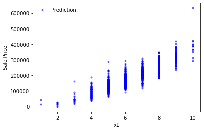
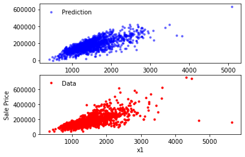

```python
from scipy import stats
import numpy as np
import pandas as pd 
import matplotlib
import matplotlib.pyplot as plt
import math
import collections
from sklearn.linear_model import Lasso 
```


```python
train = pd.read_csv("D:/Maestría/AI/Proyecto 1/train.csv")
test = pd.read_csv("D:/Maestría/AI/Proyecto 1/test.csv")
```


```python
test
```


<div>
<style scoped>
    .dataframe tbody tr th:only-of-type {
        vertical-align: middle;
    }

    .dataframe tbody tr th {
        vertical-align: top;
    }

    .dataframe thead th {
        text-align: right;
    }
</style>
<table border="1" class="dataframe">
  <thead>
    <tr style="text-align: right;">
      <th></th>
      <th>Id</th>
      <th>MSSubClass</th>
      <th>MSZoning</th>
      <th>LotFrontage</th>
      <th>LotArea</th>
      <th>Street</th>
      <th>Alley</th>
      <th>LotShape</th>
      <th>LandContour</th>
      <th>Utilities</th>
      <th>...</th>
      <th>ScreenPorch</th>
      <th>PoolArea</th>
      <th>PoolQC</th>
      <th>Fence</th>
      <th>MiscFeature</th>
      <th>MiscVal</th>
      <th>MoSold</th>
      <th>YrSold</th>
      <th>SaleType</th>
      <th>SaleCondition</th>
    </tr>
  </thead>
  <tbody>
    <tr>
      <th>0</th>
      <td>1461</td>
      <td>20</td>
      <td>RH</td>
      <td>80.0</td>
      <td>11622</td>
      <td>Pave</td>
      <td>NaN</td>
      <td>Reg</td>
      <td>Lvl</td>
      <td>AllPub</td>
      <td>...</td>
      <td>120</td>
      <td>0</td>
      <td>NaN</td>
      <td>MnPrv</td>
      <td>NaN</td>
      <td>0</td>
      <td>6</td>
      <td>2010</td>
      <td>WD</td>
      <td>Normal</td>
    </tr>
    <tr>
      <th>1</th>
      <td>1462</td>
      <td>20</td>
      <td>RL</td>
      <td>81.0</td>
      <td>14267</td>
      <td>Pave</td>
      <td>NaN</td>
      <td>IR1</td>
      <td>Lvl</td>
      <td>AllPub</td>
      <td>...</td>
      <td>0</td>
      <td>0</td>
      <td>NaN</td>
      <td>NaN</td>
      <td>Gar2</td>
      <td>12500</td>
      <td>6</td>
      <td>2010</td>
      <td>WD</td>
      <td>Normal</td>
    </tr>
    <tr>
      <th>2</th>
      <td>1463</td>
      <td>60</td>
      <td>RL</td>
      <td>74.0</td>
      <td>13830</td>
      <td>Pave</td>
      <td>NaN</td>
      <td>IR1</td>
      <td>Lvl</td>
      <td>AllPub</td>
      <td>...</td>
      <td>0</td>
      <td>0</td>
      <td>NaN</td>
      <td>MnPrv</td>
      <td>NaN</td>
      <td>0</td>
      <td>3</td>
      <td>2010</td>
      <td>WD</td>
      <td>Normal</td>
    </tr>
    <tr>
      <th>3</th>
      <td>1464</td>
      <td>60</td>
      <td>RL</td>
      <td>78.0</td>
      <td>9978</td>
      <td>Pave</td>
      <td>NaN</td>
      <td>IR1</td>
      <td>Lvl</td>
      <td>AllPub</td>
      <td>...</td>
      <td>0</td>
      <td>0</td>
      <td>NaN</td>
      <td>NaN</td>
      <td>NaN</td>
      <td>0</td>
      <td>6</td>
      <td>2010</td>
      <td>WD</td>
      <td>Normal</td>
    </tr>
    <tr>
      <th>4</th>
      <td>1465</td>
      <td>120</td>
      <td>RL</td>
      <td>43.0</td>
      <td>5005</td>
      <td>Pave</td>
      <td>NaN</td>
      <td>IR1</td>
      <td>HLS</td>
      <td>AllPub</td>
      <td>...</td>
      <td>144</td>
      <td>0</td>
      <td>NaN</td>
      <td>NaN</td>
      <td>NaN</td>
      <td>0</td>
      <td>1</td>
      <td>2010</td>
      <td>WD</td>
      <td>Normal</td>
    </tr>
    <tr>
      <th>...</th>
      <td>...</td>
      <td>...</td>
      <td>...</td>
      <td>...</td>
      <td>...</td>
      <td>...</td>
      <td>...</td>
      <td>...</td>
      <td>...</td>
      <td>...</td>
      <td>...</td>
      <td>...</td>
      <td>...</td>
      <td>...</td>
      <td>...</td>
      <td>...</td>
      <td>...</td>
      <td>...</td>
      <td>...</td>
      <td>...</td>
      <td>...</td>
    </tr>
    <tr>
      <th>1454</th>
      <td>2915</td>
      <td>160</td>
      <td>RM</td>
      <td>21.0</td>
      <td>1936</td>
      <td>Pave</td>
      <td>NaN</td>
      <td>Reg</td>
      <td>Lvl</td>
      <td>AllPub</td>
      <td>...</td>
      <td>0</td>
      <td>0</td>
      <td>NaN</td>
      <td>NaN</td>
      <td>NaN</td>
      <td>0</td>
      <td>6</td>
      <td>2006</td>
      <td>WD</td>
      <td>Normal</td>
    </tr>
    <tr>
      <th>1455</th>
      <td>2916</td>
      <td>160</td>
      <td>RM</td>
      <td>21.0</td>
      <td>1894</td>
      <td>Pave</td>
      <td>NaN</td>
      <td>Reg</td>
      <td>Lvl</td>
      <td>AllPub</td>
      <td>...</td>
      <td>0</td>
      <td>0</td>
      <td>NaN</td>
      <td>NaN</td>
      <td>NaN</td>
      <td>0</td>
      <td>4</td>
      <td>2006</td>
      <td>WD</td>
      <td>Abnorml</td>
    </tr>
    <tr>
      <th>1456</th>
      <td>2917</td>
      <td>20</td>
      <td>RL</td>
      <td>160.0</td>
      <td>20000</td>
      <td>Pave</td>
      <td>NaN</td>
      <td>Reg</td>
      <td>Lvl</td>
      <td>AllPub</td>
      <td>...</td>
      <td>0</td>
      <td>0</td>
      <td>NaN</td>
      <td>NaN</td>
      <td>NaN</td>
      <td>0</td>
      <td>9</td>
      <td>2006</td>
      <td>WD</td>
      <td>Abnorml</td>
    </tr>
    <tr>
      <th>1457</th>
      <td>2918</td>
      <td>85</td>
      <td>RL</td>
      <td>62.0</td>
      <td>10441</td>
      <td>Pave</td>
      <td>NaN</td>
      <td>Reg</td>
      <td>Lvl</td>
      <td>AllPub</td>
      <td>...</td>
      <td>0</td>
      <td>0</td>
      <td>NaN</td>
      <td>MnPrv</td>
      <td>Shed</td>
      <td>700</td>
      <td>7</td>
      <td>2006</td>
      <td>WD</td>
      <td>Normal</td>
    </tr>
    <tr>
      <th>1458</th>
      <td>2919</td>
      <td>60</td>
      <td>RL</td>
      <td>74.0</td>
      <td>9627</td>
      <td>Pave</td>
      <td>NaN</td>
      <td>Reg</td>
      <td>Lvl</td>
      <td>AllPub</td>
      <td>...</td>
      <td>0</td>
      <td>0</td>
      <td>NaN</td>
      <td>NaN</td>
      <td>NaN</td>
      <td>0</td>
      <td>11</td>
      <td>2006</td>
      <td>WD</td>
      <td>Normal</td>
    </tr>
  </tbody>
</table>
<p>1459 rows × 80 columns</p>
</div>


```python
train
```


<div>
<style scoped>
    .dataframe tbody tr th:only-of-type {
        vertical-align: middle;
    }

    .dataframe tbody tr th {
        vertical-align: top;
    }

    .dataframe thead th {
        text-align: right;
    }
</style>
<table border="1" class="dataframe">
  <thead>
    <tr style="text-align: right;">
      <th></th>
      <th>Id</th>
      <th>MSSubClass</th>
      <th>MSZoning</th>
      <th>LotFrontage</th>
      <th>LotArea</th>
      <th>Street</th>
      <th>Alley</th>
      <th>LotShape</th>
      <th>LandContour</th>
      <th>Utilities</th>
      <th>...</th>
      <th>PoolArea</th>
      <th>PoolQC</th>
      <th>Fence</th>
      <th>MiscFeature</th>
      <th>MiscVal</th>
      <th>MoSold</th>
      <th>YrSold</th>
      <th>SaleType</th>
      <th>SaleCondition</th>
      <th>SalePrice</th>
    </tr>
  </thead>
  <tbody>
    <tr>
      <th>0</th>
      <td>1</td>
      <td>60</td>
      <td>RL</td>
      <td>65.0</td>
      <td>8450</td>
      <td>Pave</td>
      <td>NaN</td>
      <td>Reg</td>
      <td>Lvl</td>
      <td>AllPub</td>
      <td>...</td>
      <td>0</td>
      <td>NaN</td>
      <td>NaN</td>
      <td>NaN</td>
      <td>0</td>
      <td>2</td>
      <td>2008</td>
      <td>WD</td>
      <td>Normal</td>
      <td>208500</td>
    </tr>
    <tr>
      <th>1</th>
      <td>2</td>
      <td>20</td>
      <td>RL</td>
      <td>80.0</td>
      <td>9600</td>
      <td>Pave</td>
      <td>NaN</td>
      <td>Reg</td>
      <td>Lvl</td>
      <td>AllPub</td>
      <td>...</td>
      <td>0</td>
      <td>NaN</td>
      <td>NaN</td>
      <td>NaN</td>
      <td>0</td>
      <td>5</td>
      <td>2007</td>
      <td>WD</td>
      <td>Normal</td>
      <td>181500</td>
    </tr>
    <tr>
      <th>2</th>
      <td>3</td>
      <td>60</td>
      <td>RL</td>
      <td>68.0</td>
      <td>11250</td>
      <td>Pave</td>
      <td>NaN</td>
      <td>IR1</td>
      <td>Lvl</td>
      <td>AllPub</td>
      <td>...</td>
      <td>0</td>
      <td>NaN</td>
      <td>NaN</td>
      <td>NaN</td>
      <td>0</td>
      <td>9</td>
      <td>2008</td>
      <td>WD</td>
      <td>Normal</td>
      <td>223500</td>
    </tr>
    <tr>
      <th>3</th>
      <td>4</td>
      <td>70</td>
      <td>RL</td>
      <td>60.0</td>
      <td>9550</td>
      <td>Pave</td>
      <td>NaN</td>
      <td>IR1</td>
      <td>Lvl</td>
      <td>AllPub</td>
      <td>...</td>
      <td>0</td>
      <td>NaN</td>
      <td>NaN</td>
      <td>NaN</td>
      <td>0</td>
      <td>2</td>
      <td>2006</td>
      <td>WD</td>
      <td>Abnorml</td>
      <td>140000</td>
    </tr>
    <tr>
      <th>4</th>
      <td>5</td>
      <td>60</td>
      <td>RL</td>
      <td>84.0</td>
      <td>14260</td>
      <td>Pave</td>
      <td>NaN</td>
      <td>IR1</td>
      <td>Lvl</td>
      <td>AllPub</td>
      <td>...</td>
      <td>0</td>
      <td>NaN</td>
      <td>NaN</td>
      <td>NaN</td>
      <td>0</td>
      <td>12</td>
      <td>2008</td>
      <td>WD</td>
      <td>Normal</td>
      <td>250000</td>
    </tr>
    <tr>
      <th>...</th>
      <td>...</td>
      <td>...</td>
      <td>...</td>
      <td>...</td>
      <td>...</td>
      <td>...</td>
      <td>...</td>
      <td>...</td>
      <td>...</td>
      <td>...</td>
      <td>...</td>
      <td>...</td>
      <td>...</td>
      <td>...</td>
      <td>...</td>
      <td>...</td>
      <td>...</td>
      <td>...</td>
      <td>...</td>
      <td>...</td>
      <td>...</td>
    </tr>
    <tr>
      <th>1455</th>
      <td>1456</td>
      <td>60</td>
      <td>RL</td>
      <td>62.0</td>
      <td>7917</td>
      <td>Pave</td>
      <td>NaN</td>
      <td>Reg</td>
      <td>Lvl</td>
      <td>AllPub</td>
      <td>...</td>
      <td>0</td>
      <td>NaN</td>
      <td>NaN</td>
      <td>NaN</td>
      <td>0</td>
      <td>8</td>
      <td>2007</td>
      <td>WD</td>
      <td>Normal</td>
      <td>175000</td>
    </tr>
    <tr>
      <th>1456</th>
      <td>1457</td>
      <td>20</td>
      <td>RL</td>
      <td>85.0</td>
      <td>13175</td>
      <td>Pave</td>
      <td>NaN</td>
      <td>Reg</td>
      <td>Lvl</td>
      <td>AllPub</td>
      <td>...</td>
      <td>0</td>
      <td>NaN</td>
      <td>MnPrv</td>
      <td>NaN</td>
      <td>0</td>
      <td>2</td>
      <td>2010</td>
      <td>WD</td>
      <td>Normal</td>
      <td>210000</td>
    </tr>
    <tr>
      <th>1457</th>
      <td>1458</td>
      <td>70</td>
      <td>RL</td>
      <td>66.0</td>
      <td>9042</td>
      <td>Pave</td>
      <td>NaN</td>
      <td>Reg</td>
      <td>Lvl</td>
      <td>AllPub</td>
      <td>...</td>
      <td>0</td>
      <td>NaN</td>
      <td>GdPrv</td>
      <td>Shed</td>
      <td>2500</td>
      <td>5</td>
      <td>2010</td>
      <td>WD</td>
      <td>Normal</td>
      <td>266500</td>
    </tr>
    <tr>
      <th>1458</th>
      <td>1459</td>
      <td>20</td>
      <td>RL</td>
      <td>68.0</td>
      <td>9717</td>
      <td>Pave</td>
      <td>NaN</td>
      <td>Reg</td>
      <td>Lvl</td>
      <td>AllPub</td>
      <td>...</td>
      <td>0</td>
      <td>NaN</td>
      <td>NaN</td>
      <td>NaN</td>
      <td>0</td>
      <td>4</td>
      <td>2010</td>
      <td>WD</td>
      <td>Normal</td>
      <td>142125</td>
    </tr>
    <tr>
      <th>1459</th>
      <td>1460</td>
      <td>20</td>
      <td>RL</td>
      <td>75.0</td>
      <td>9937</td>
      <td>Pave</td>
      <td>NaN</td>
      <td>Reg</td>
      <td>Lvl</td>
      <td>AllPub</td>
      <td>...</td>
      <td>0</td>
      <td>NaN</td>
      <td>NaN</td>
      <td>NaN</td>
      <td>0</td>
      <td>6</td>
      <td>2008</td>
      <td>WD</td>
      <td>Normal</td>
      <td>147500</td>
    </tr>
  </tbody>
</table>
<p>1460 rows × 81 columns</p>
</div>


```python
train.corr()
```


<div>
<style scoped>
    .dataframe tbody tr th:only-of-type {
        vertical-align: middle;
    }

    .dataframe tbody tr th {
        vertical-align: top;
    }

    .dataframe thead th {
        text-align: right;
    }
</style>
<table border="1" class="dataframe">
  <thead>
    <tr style="text-align: right;">
      <th></th>
      <th>Id</th>
      <th>MSSubClass</th>
      <th>LotFrontage</th>
      <th>LotArea</th>
      <th>OverallQual</th>
      <th>OverallCond</th>
      <th>YearBuilt</th>
      <th>YearRemodAdd</th>
      <th>MasVnrArea</th>
      <th>BsmtFinSF1</th>
      <th>...</th>
      <th>WoodDeckSF</th>
      <th>OpenPorchSF</th>
      <th>EnclosedPorch</th>
      <th>3SsnPorch</th>
      <th>ScreenPorch</th>
      <th>PoolArea</th>
      <th>MiscVal</th>
      <th>MoSold</th>
      <th>YrSold</th>
      <th>SalePrice</th>
    </tr>
  </thead>
  <tbody>
    <tr>
      <th>Id</th>
      <td>1.000000</td>
      <td>0.011156</td>
      <td>-0.010601</td>
      <td>-0.033226</td>
      <td>-0.028365</td>
      <td>0.012609</td>
      <td>-0.012713</td>
      <td>-0.021998</td>
      <td>-0.050298</td>
      <td>-0.005024</td>
      <td>...</td>
      <td>-0.029643</td>
      <td>-0.000477</td>
      <td>0.002889</td>
      <td>-0.046635</td>
      <td>0.001330</td>
      <td>0.057044</td>
      <td>-0.006242</td>
      <td>0.021172</td>
      <td>0.000712</td>
      <td>-0.021917</td>
    </tr>
    <tr>
      <th>MSSubClass</th>
      <td>0.011156</td>
      <td>1.000000</td>
      <td>-0.386347</td>
      <td>-0.139781</td>
      <td>0.032628</td>
      <td>-0.059316</td>
      <td>0.027850</td>
      <td>0.040581</td>
      <td>0.022936</td>
      <td>-0.069836</td>
      <td>...</td>
      <td>-0.012579</td>
      <td>-0.006100</td>
      <td>-0.012037</td>
      <td>-0.043825</td>
      <td>-0.026030</td>
      <td>0.008283</td>
      <td>-0.007683</td>
      <td>-0.013585</td>
      <td>-0.021407</td>
      <td>-0.084284</td>
    </tr>
    <tr>
      <th>LotFrontage</th>
      <td>-0.010601</td>
      <td>-0.386347</td>
      <td>1.000000</td>
      <td>0.426095</td>
      <td>0.251646</td>
      <td>-0.059213</td>
      <td>0.123349</td>
      <td>0.088866</td>
      <td>0.193458</td>
      <td>0.233633</td>
      <td>...</td>
      <td>0.088521</td>
      <td>0.151972</td>
      <td>0.010700</td>
      <td>0.070029</td>
      <td>0.041383</td>
      <td>0.206167</td>
      <td>0.003368</td>
      <td>0.011200</td>
      <td>0.007450</td>
      <td>0.351799</td>
    </tr>
    <tr>
      <th>LotArea</th>
      <td>-0.033226</td>
      <td>-0.139781</td>
      <td>0.426095</td>
      <td>1.000000</td>
      <td>0.105806</td>
      <td>-0.005636</td>
      <td>0.014228</td>
      <td>0.013788</td>
      <td>0.104160</td>
      <td>0.214103</td>
      <td>...</td>
      <td>0.171698</td>
      <td>0.084774</td>
      <td>-0.018340</td>
      <td>0.020423</td>
      <td>0.043160</td>
      <td>0.077672</td>
      <td>0.038068</td>
      <td>0.001205</td>
      <td>-0.014261</td>
      <td>0.263843</td>
    </tr>
    <tr>
      <th>OverallQual</th>
      <td>-0.028365</td>
      <td>0.032628</td>
      <td>0.251646</td>
      <td>0.105806</td>
      <td>1.000000</td>
      <td>-0.091932</td>
      <td>0.572323</td>
      <td>0.550684</td>
      <td>0.411876</td>
      <td>0.239666</td>
      <td>...</td>
      <td>0.238923</td>
      <td>0.308819</td>
      <td>-0.113937</td>
      <td>0.030371</td>
      <td>0.064886</td>
      <td>0.065166</td>
      <td>-0.031406</td>
      <td>0.070815</td>
      <td>-0.027347</td>
      <td>0.790982</td>
    </tr>
    <tr>
      <th>OverallCond</th>
      <td>0.012609</td>
      <td>-0.059316</td>
      <td>-0.059213</td>
      <td>-0.005636</td>
      <td>-0.091932</td>
      <td>1.000000</td>
      <td>-0.375983</td>
      <td>0.073741</td>
      <td>-0.128101</td>
      <td>-0.046231</td>
      <td>...</td>
      <td>-0.003334</td>
      <td>-0.032589</td>
      <td>0.070356</td>
      <td>0.025504</td>
      <td>0.054811</td>
      <td>-0.001985</td>
      <td>0.068777</td>
      <td>-0.003511</td>
      <td>0.043950</td>
      <td>-0.077856</td>
    </tr>
    <tr>
      <th>YearBuilt</th>
      <td>-0.012713</td>
      <td>0.027850</td>
      <td>0.123349</td>
      <td>0.014228</td>
      <td>0.572323</td>
      <td>-0.375983</td>
      <td>1.000000</td>
      <td>0.592855</td>
      <td>0.315707</td>
      <td>0.249503</td>
      <td>...</td>
      <td>0.224880</td>
      <td>0.188686</td>
      <td>-0.387268</td>
      <td>0.031355</td>
      <td>-0.050364</td>
      <td>0.004950</td>
      <td>-0.034383</td>
      <td>0.012398</td>
      <td>-0.013618</td>
      <td>0.522897</td>
    </tr>
    <tr>
      <th>YearRemodAdd</th>
      <td>-0.021998</td>
      <td>0.040581</td>
      <td>0.088866</td>
      <td>0.013788</td>
      <td>0.550684</td>
      <td>0.073741</td>
      <td>0.592855</td>
      <td>1.000000</td>
      <td>0.179618</td>
      <td>0.128451</td>
      <td>...</td>
      <td>0.205726</td>
      <td>0.226298</td>
      <td>-0.193919</td>
      <td>0.045286</td>
      <td>-0.038740</td>
      <td>0.005829</td>
      <td>-0.010286</td>
      <td>0.021490</td>
      <td>0.035743</td>
      <td>0.507101</td>
    </tr>
    <tr>
      <th>MasVnrArea</th>
      <td>-0.050298</td>
      <td>0.022936</td>
      <td>0.193458</td>
      <td>0.104160</td>
      <td>0.411876</td>
      <td>-0.128101</td>
      <td>0.315707</td>
      <td>0.179618</td>
      <td>1.000000</td>
      <td>0.264736</td>
      <td>...</td>
      <td>0.159718</td>
      <td>0.125703</td>
      <td>-0.110204</td>
      <td>0.018796</td>
      <td>0.061466</td>
      <td>0.011723</td>
      <td>-0.029815</td>
      <td>-0.005965</td>
      <td>-0.008201</td>
      <td>0.477493</td>
    </tr>
    <tr>
      <th>BsmtFinSF1</th>
      <td>-0.005024</td>
      <td>-0.069836</td>
      <td>0.233633</td>
      <td>0.214103</td>
      <td>0.239666</td>
      <td>-0.046231</td>
      <td>0.249503</td>
      <td>0.128451</td>
      <td>0.264736</td>
      <td>1.000000</td>
      <td>...</td>
      <td>0.204306</td>
      <td>0.111761</td>
      <td>-0.102303</td>
      <td>0.026451</td>
      <td>0.062021</td>
      <td>0.140491</td>
      <td>0.003571</td>
      <td>-0.015727</td>
      <td>0.014359</td>
      <td>0.386420</td>
    </tr>
    <tr>
      <th>BsmtFinSF2</th>
      <td>-0.005968</td>
      <td>-0.065649</td>
      <td>0.049900</td>
      <td>0.111170</td>
      <td>-0.059119</td>
      <td>0.040229</td>
      <td>-0.049107</td>
      <td>-0.067759</td>
      <td>-0.072319</td>
      <td>-0.050117</td>
      <td>...</td>
      <td>0.067898</td>
      <td>0.003093</td>
      <td>0.036543</td>
      <td>-0.029993</td>
      <td>0.088871</td>
      <td>0.041709</td>
      <td>0.004940</td>
      <td>-0.015211</td>
      <td>0.031706</td>
      <td>-0.011378</td>
    </tr>
    <tr>
      <th>BsmtUnfSF</th>
      <td>-0.007940</td>
      <td>-0.140759</td>
      <td>0.132644</td>
      <td>-0.002618</td>
      <td>0.308159</td>
      <td>-0.136841</td>
      <td>0.149040</td>
      <td>0.181133</td>
      <td>0.114442</td>
      <td>-0.495251</td>
      <td>...</td>
      <td>-0.005316</td>
      <td>0.129005</td>
      <td>-0.002538</td>
      <td>0.020764</td>
      <td>-0.012579</td>
      <td>-0.035092</td>
      <td>-0.023837</td>
      <td>0.034888</td>
      <td>-0.041258</td>
      <td>0.214479</td>
    </tr>
    <tr>
      <th>TotalBsmtSF</th>
      <td>-0.015415</td>
      <td>-0.238518</td>
      <td>0.392075</td>
      <td>0.260833</td>
      <td>0.537808</td>
      <td>-0.171098</td>
      <td>0.391452</td>
      <td>0.291066</td>
      <td>0.363936</td>
      <td>0.522396</td>
      <td>...</td>
      <td>0.232019</td>
      <td>0.247264</td>
      <td>-0.095478</td>
      <td>0.037384</td>
      <td>0.084489</td>
      <td>0.126053</td>
      <td>-0.018479</td>
      <td>0.013196</td>
      <td>-0.014969</td>
      <td>0.613581</td>
    </tr>
    <tr>
      <th>1stFlrSF</th>
      <td>0.010496</td>
      <td>-0.251758</td>
      <td>0.457181</td>
      <td>0.299475</td>
      <td>0.476224</td>
      <td>-0.144203</td>
      <td>0.281986</td>
      <td>0.240379</td>
      <td>0.344501</td>
      <td>0.445863</td>
      <td>...</td>
      <td>0.235459</td>
      <td>0.211671</td>
      <td>-0.065292</td>
      <td>0.056104</td>
      <td>0.088758</td>
      <td>0.131525</td>
      <td>-0.021096</td>
      <td>0.031372</td>
      <td>-0.013604</td>
      <td>0.605852</td>
    </tr>
    <tr>
      <th>2ndFlrSF</th>
      <td>0.005590</td>
      <td>0.307886</td>
      <td>0.080177</td>
      <td>0.050986</td>
      <td>0.295493</td>
      <td>0.028942</td>
      <td>0.010308</td>
      <td>0.140024</td>
      <td>0.174561</td>
      <td>-0.137079</td>
      <td>...</td>
      <td>0.092165</td>
      <td>0.208026</td>
      <td>0.061989</td>
      <td>-0.024358</td>
      <td>0.040606</td>
      <td>0.081487</td>
      <td>0.016197</td>
      <td>0.035164</td>
      <td>-0.028700</td>
      <td>0.319334</td>
    </tr>
    <tr>
      <th>LowQualFinSF</th>
      <td>-0.044230</td>
      <td>0.046474</td>
      <td>0.038469</td>
      <td>0.004779</td>
      <td>-0.030429</td>
      <td>0.025494</td>
      <td>-0.183784</td>
      <td>-0.062419</td>
      <td>-0.069071</td>
      <td>-0.064503</td>
      <td>...</td>
      <td>-0.025444</td>
      <td>0.018251</td>
      <td>0.061081</td>
      <td>-0.004296</td>
      <td>0.026799</td>
      <td>0.062157</td>
      <td>-0.003793</td>
      <td>-0.022174</td>
      <td>-0.028921</td>
      <td>-0.025606</td>
    </tr>
    <tr>
      <th>GrLivArea</th>
      <td>0.008273</td>
      <td>0.074853</td>
      <td>0.402797</td>
      <td>0.263116</td>
      <td>0.593007</td>
      <td>-0.079686</td>
      <td>0.199010</td>
      <td>0.287389</td>
      <td>0.390857</td>
      <td>0.208171</td>
      <td>...</td>
      <td>0.247433</td>
      <td>0.330224</td>
      <td>0.009113</td>
      <td>0.020643</td>
      <td>0.101510</td>
      <td>0.170205</td>
      <td>-0.002416</td>
      <td>0.050240</td>
      <td>-0.036526</td>
      <td>0.708624</td>
    </tr>
    <tr>
      <th>BsmtFullBath</th>
      <td>0.002289</td>
      <td>0.003491</td>
      <td>0.100949</td>
      <td>0.158155</td>
      <td>0.111098</td>
      <td>-0.054942</td>
      <td>0.187599</td>
      <td>0.119470</td>
      <td>0.085310</td>
      <td>0.649212</td>
      <td>...</td>
      <td>0.175315</td>
      <td>0.067341</td>
      <td>-0.049911</td>
      <td>-0.000106</td>
      <td>0.023148</td>
      <td>0.067616</td>
      <td>-0.023047</td>
      <td>-0.025361</td>
      <td>0.067049</td>
      <td>0.227122</td>
    </tr>
    <tr>
      <th>BsmtHalfBath</th>
      <td>-0.020155</td>
      <td>-0.002333</td>
      <td>-0.007234</td>
      <td>0.048046</td>
      <td>-0.040150</td>
      <td>0.117821</td>
      <td>-0.038162</td>
      <td>-0.012337</td>
      <td>0.026673</td>
      <td>0.067418</td>
      <td>...</td>
      <td>0.040161</td>
      <td>-0.025324</td>
      <td>-0.008555</td>
      <td>0.035114</td>
      <td>0.032121</td>
      <td>0.020025</td>
      <td>-0.007367</td>
      <td>0.032873</td>
      <td>-0.046524</td>
      <td>-0.016844</td>
    </tr>
    <tr>
      <th>FullBath</th>
      <td>0.005587</td>
      <td>0.131608</td>
      <td>0.198769</td>
      <td>0.126031</td>
      <td>0.550600</td>
      <td>-0.194149</td>
      <td>0.468271</td>
      <td>0.439046</td>
      <td>0.276833</td>
      <td>0.058543</td>
      <td>...</td>
      <td>0.187703</td>
      <td>0.259977</td>
      <td>-0.115093</td>
      <td>0.035353</td>
      <td>-0.008106</td>
      <td>0.049604</td>
      <td>-0.014290</td>
      <td>0.055872</td>
      <td>-0.019669</td>
      <td>0.560664</td>
    </tr>
    <tr>
      <th>HalfBath</th>
      <td>0.006784</td>
      <td>0.177354</td>
      <td>0.053532</td>
      <td>0.014259</td>
      <td>0.273458</td>
      <td>-0.060769</td>
      <td>0.242656</td>
      <td>0.183331</td>
      <td>0.201444</td>
      <td>0.004262</td>
      <td>...</td>
      <td>0.108080</td>
      <td>0.199740</td>
      <td>-0.095317</td>
      <td>-0.004972</td>
      <td>0.072426</td>
      <td>0.022381</td>
      <td>0.001290</td>
      <td>-0.009050</td>
      <td>-0.010269</td>
      <td>0.284108</td>
    </tr>
    <tr>
      <th>BedroomAbvGr</th>
      <td>0.037719</td>
      <td>-0.023438</td>
      <td>0.263170</td>
      <td>0.119690</td>
      <td>0.101676</td>
      <td>0.012980</td>
      <td>-0.070651</td>
      <td>-0.040581</td>
      <td>0.102821</td>
      <td>-0.107355</td>
      <td>...</td>
      <td>0.046854</td>
      <td>0.093810</td>
      <td>0.041570</td>
      <td>-0.024478</td>
      <td>0.044300</td>
      <td>0.070703</td>
      <td>0.007767</td>
      <td>0.046544</td>
      <td>-0.036014</td>
      <td>0.168213</td>
    </tr>
    <tr>
      <th>KitchenAbvGr</th>
      <td>0.002951</td>
      <td>0.281721</td>
      <td>-0.006069</td>
      <td>-0.017784</td>
      <td>-0.183882</td>
      <td>-0.087001</td>
      <td>-0.174800</td>
      <td>-0.149598</td>
      <td>-0.037610</td>
      <td>-0.081007</td>
      <td>...</td>
      <td>-0.090130</td>
      <td>-0.070091</td>
      <td>0.037312</td>
      <td>-0.024600</td>
      <td>-0.051613</td>
      <td>-0.014525</td>
      <td>0.062341</td>
      <td>0.026589</td>
      <td>0.031687</td>
      <td>-0.135907</td>
    </tr>
    <tr>
      <th>TotRmsAbvGrd</th>
      <td>0.027239</td>
      <td>0.040380</td>
      <td>0.352096</td>
      <td>0.190015</td>
      <td>0.427452</td>
      <td>-0.057583</td>
      <td>0.095589</td>
      <td>0.191740</td>
      <td>0.280682</td>
      <td>0.044316</td>
      <td>...</td>
      <td>0.165984</td>
      <td>0.234192</td>
      <td>0.004151</td>
      <td>-0.006683</td>
      <td>0.059383</td>
      <td>0.083757</td>
      <td>0.024763</td>
      <td>0.036907</td>
      <td>-0.034516</td>
      <td>0.533723</td>
    </tr>
    <tr>
      <th>Fireplaces</th>
      <td>-0.019772</td>
      <td>-0.045569</td>
      <td>0.266639</td>
      <td>0.271364</td>
      <td>0.396765</td>
      <td>-0.023820</td>
      <td>0.147716</td>
      <td>0.112581</td>
      <td>0.249070</td>
      <td>0.260011</td>
      <td>...</td>
      <td>0.200019</td>
      <td>0.169405</td>
      <td>-0.024822</td>
      <td>0.011257</td>
      <td>0.184530</td>
      <td>0.095074</td>
      <td>0.001409</td>
      <td>0.046357</td>
      <td>-0.024096</td>
      <td>0.466929</td>
    </tr>
    <tr>
      <th>GarageYrBlt</th>
      <td>0.000072</td>
      <td>0.085072</td>
      <td>0.070250</td>
      <td>-0.024947</td>
      <td>0.547766</td>
      <td>-0.324297</td>
      <td>0.825667</td>
      <td>0.642277</td>
      <td>0.252691</td>
      <td>0.153484</td>
      <td>...</td>
      <td>0.224577</td>
      <td>0.228425</td>
      <td>-0.297003</td>
      <td>0.023544</td>
      <td>-0.075418</td>
      <td>-0.014501</td>
      <td>-0.032417</td>
      <td>0.005337</td>
      <td>-0.001014</td>
      <td>0.486362</td>
    </tr>
    <tr>
      <th>GarageCars</th>
      <td>0.016570</td>
      <td>-0.040110</td>
      <td>0.285691</td>
      <td>0.154871</td>
      <td>0.600671</td>
      <td>-0.185758</td>
      <td>0.537850</td>
      <td>0.420622</td>
      <td>0.364204</td>
      <td>0.224054</td>
      <td>...</td>
      <td>0.226342</td>
      <td>0.213569</td>
      <td>-0.151434</td>
      <td>0.035765</td>
      <td>0.050494</td>
      <td>0.020934</td>
      <td>-0.043080</td>
      <td>0.040522</td>
      <td>-0.039117</td>
      <td>0.640409</td>
    </tr>
    <tr>
      <th>GarageArea</th>
      <td>0.017634</td>
      <td>-0.098672</td>
      <td>0.344997</td>
      <td>0.180403</td>
      <td>0.562022</td>
      <td>-0.151521</td>
      <td>0.478954</td>
      <td>0.371600</td>
      <td>0.373066</td>
      <td>0.296970</td>
      <td>...</td>
      <td>0.224666</td>
      <td>0.241435</td>
      <td>-0.121777</td>
      <td>0.035087</td>
      <td>0.051412</td>
      <td>0.061047</td>
      <td>-0.027400</td>
      <td>0.027974</td>
      <td>-0.027378</td>
      <td>0.623431</td>
    </tr>
    <tr>
      <th>WoodDeckSF</th>
      <td>-0.029643</td>
      <td>-0.012579</td>
      <td>0.088521</td>
      <td>0.171698</td>
      <td>0.238923</td>
      <td>-0.003334</td>
      <td>0.224880</td>
      <td>0.205726</td>
      <td>0.159718</td>
      <td>0.204306</td>
      <td>...</td>
      <td>1.000000</td>
      <td>0.058661</td>
      <td>-0.125989</td>
      <td>-0.032771</td>
      <td>-0.074181</td>
      <td>0.073378</td>
      <td>-0.009551</td>
      <td>0.021011</td>
      <td>0.022270</td>
      <td>0.324413</td>
    </tr>
    <tr>
      <th>OpenPorchSF</th>
      <td>-0.000477</td>
      <td>-0.006100</td>
      <td>0.151972</td>
      <td>0.084774</td>
      <td>0.308819</td>
      <td>-0.032589</td>
      <td>0.188686</td>
      <td>0.226298</td>
      <td>0.125703</td>
      <td>0.111761</td>
      <td>...</td>
      <td>0.058661</td>
      <td>1.000000</td>
      <td>-0.093079</td>
      <td>-0.005842</td>
      <td>0.074304</td>
      <td>0.060762</td>
      <td>-0.018584</td>
      <td>0.071255</td>
      <td>-0.057619</td>
      <td>0.315856</td>
    </tr>
    <tr>
      <th>EnclosedPorch</th>
      <td>0.002889</td>
      <td>-0.012037</td>
      <td>0.010700</td>
      <td>-0.018340</td>
      <td>-0.113937</td>
      <td>0.070356</td>
      <td>-0.387268</td>
      <td>-0.193919</td>
      <td>-0.110204</td>
      <td>-0.102303</td>
      <td>...</td>
      <td>-0.125989</td>
      <td>-0.093079</td>
      <td>1.000000</td>
      <td>-0.037305</td>
      <td>-0.082864</td>
      <td>0.054203</td>
      <td>0.018361</td>
      <td>-0.028887</td>
      <td>-0.009916</td>
      <td>-0.128578</td>
    </tr>
    <tr>
      <th>3SsnPorch</th>
      <td>-0.046635</td>
      <td>-0.043825</td>
      <td>0.070029</td>
      <td>0.020423</td>
      <td>0.030371</td>
      <td>0.025504</td>
      <td>0.031355</td>
      <td>0.045286</td>
      <td>0.018796</td>
      <td>0.026451</td>
      <td>...</td>
      <td>-0.032771</td>
      <td>-0.005842</td>
      <td>-0.037305</td>
      <td>1.000000</td>
      <td>-0.031436</td>
      <td>-0.007992</td>
      <td>0.000354</td>
      <td>0.029474</td>
      <td>0.018645</td>
      <td>0.044584</td>
    </tr>
    <tr>
      <th>ScreenPorch</th>
      <td>0.001330</td>
      <td>-0.026030</td>
      <td>0.041383</td>
      <td>0.043160</td>
      <td>0.064886</td>
      <td>0.054811</td>
      <td>-0.050364</td>
      <td>-0.038740</td>
      <td>0.061466</td>
      <td>0.062021</td>
      <td>...</td>
      <td>-0.074181</td>
      <td>0.074304</td>
      <td>-0.082864</td>
      <td>-0.031436</td>
      <td>1.000000</td>
      <td>0.051307</td>
      <td>0.031946</td>
      <td>0.023217</td>
      <td>0.010694</td>
      <td>0.111447</td>
    </tr>
    <tr>
      <th>PoolArea</th>
      <td>0.057044</td>
      <td>0.008283</td>
      <td>0.206167</td>
      <td>0.077672</td>
      <td>0.065166</td>
      <td>-0.001985</td>
      <td>0.004950</td>
      <td>0.005829</td>
      <td>0.011723</td>
      <td>0.140491</td>
      <td>...</td>
      <td>0.073378</td>
      <td>0.060762</td>
      <td>0.054203</td>
      <td>-0.007992</td>
      <td>0.051307</td>
      <td>1.000000</td>
      <td>0.029669</td>
      <td>-0.033737</td>
      <td>-0.059689</td>
      <td>0.092404</td>
    </tr>
    <tr>
      <th>MiscVal</th>
      <td>-0.006242</td>
      <td>-0.007683</td>
      <td>0.003368</td>
      <td>0.038068</td>
      <td>-0.031406</td>
      <td>0.068777</td>
      <td>-0.034383</td>
      <td>-0.010286</td>
      <td>-0.029815</td>
      <td>0.003571</td>
      <td>...</td>
      <td>-0.009551</td>
      <td>-0.018584</td>
      <td>0.018361</td>
      <td>0.000354</td>
      <td>0.031946</td>
      <td>0.029669</td>
      <td>1.000000</td>
      <td>-0.006495</td>
      <td>0.004906</td>
      <td>-0.021190</td>
    </tr>
    <tr>
      <th>MoSold</th>
      <td>0.021172</td>
      <td>-0.013585</td>
      <td>0.011200</td>
      <td>0.001205</td>
      <td>0.070815</td>
      <td>-0.003511</td>
      <td>0.012398</td>
      <td>0.021490</td>
      <td>-0.005965</td>
      <td>-0.015727</td>
      <td>...</td>
      <td>0.021011</td>
      <td>0.071255</td>
      <td>-0.028887</td>
      <td>0.029474</td>
      <td>0.023217</td>
      <td>-0.033737</td>
      <td>-0.006495</td>
      <td>1.000000</td>
      <td>-0.145721</td>
      <td>0.046432</td>
    </tr>
    <tr>
      <th>YrSold</th>
      <td>0.000712</td>
      <td>-0.021407</td>
      <td>0.007450</td>
      <td>-0.014261</td>
      <td>-0.027347</td>
      <td>0.043950</td>
      <td>-0.013618</td>
      <td>0.035743</td>
      <td>-0.008201</td>
      <td>0.014359</td>
      <td>...</td>
      <td>0.022270</td>
      <td>-0.057619</td>
      <td>-0.009916</td>
      <td>0.018645</td>
      <td>0.010694</td>
      <td>-0.059689</td>
      <td>0.004906</td>
      <td>-0.145721</td>
      <td>1.000000</td>
      <td>-0.028923</td>
    </tr>
    <tr>
      <th>SalePrice</th>
      <td>-0.021917</td>
      <td>-0.084284</td>
      <td>0.351799</td>
      <td>0.263843</td>
      <td>0.790982</td>
      <td>-0.077856</td>
      <td>0.522897</td>
      <td>0.507101</td>
      <td>0.477493</td>
      <td>0.386420</td>
      <td>...</td>
      <td>0.324413</td>
      <td>0.315856</td>
      <td>-0.128578</td>
      <td>0.044584</td>
      <td>0.111447</td>
      <td>0.092404</td>
      <td>-0.021190</td>
      <td>0.046432</td>
      <td>-0.028923</td>
      <td>1.000000</td>
    </tr>
  </tbody>
</table>
<p>38 rows × 38 columns</p>
</div>


```python
train.corr()['SalePrice'].sort_values(ascending=False)
```


    SalePrice        1.000000
    OverallQual      0.790982
    GrLivArea        0.708624
    GarageCars       0.640409
    GarageArea       0.623431
    TotalBsmtSF      0.613581
    1stFlrSF         0.605852
    FullBath         0.560664
    TotRmsAbvGrd     0.533723
    YearBuilt        0.522897
    YearRemodAdd     0.507101
    GarageYrBlt      0.486362
    MasVnrArea       0.477493
    Fireplaces       0.466929
    BsmtFinSF1       0.386420
    LotFrontage      0.351799
    WoodDeckSF       0.324413
    2ndFlrSF         0.319334
    OpenPorchSF      0.315856
    HalfBath         0.284108
    LotArea          0.263843
    BsmtFullBath     0.227122
    BsmtUnfSF        0.214479
    BedroomAbvGr     0.168213
    ScreenPorch      0.111447
    PoolArea         0.092404
    MoSold           0.046432
    3SsnPorch        0.044584
    BsmtFinSF2      -0.011378
    BsmtHalfBath    -0.016844
    MiscVal         -0.021190
    Id              -0.021917
    LowQualFinSF    -0.025606
    YrSold          -0.028923
    OverallCond     -0.077856
    MSSubClass      -0.084284
    EnclosedPorch   -0.128578
    KitchenAbvGr    -0.135907
    Name: SalePrice, dtype: float64


```python
train.info()
```

    <class 'pandas.core.frame.DataFrame'>
    RangeIndex: 1460 entries, 0 to 1459
    Data columns (total 81 columns):
     #   Column         Non-Null Count  Dtype  
    ---  ------         --------------  -----  
     0   Id             1460 non-null   int64  
     1   MSSubClass     1460 non-null   int64  
     2   MSZoning       1460 non-null   object 
     3   LotFrontage    1201 non-null   float64
     4   LotArea        1460 non-null   int64  
     5   Street         1460 non-null   object 
     6   Alley          91 non-null     object 
     7   LotShape       1460 non-null   object 
     8   LandContour    1460 non-null   object 
     9   Utilities      1460 non-null   object 
     10  LotConfig      1460 non-null   object 
     11  LandSlope      1460 non-null   object 
     12  Neighborhood   1460 non-null   object 
     13  Condition1     1460 non-null   object 
     14  Condition2     1460 non-null   object 
     15  BldgType       1460 non-null   object 
     16  HouseStyle     1460 non-null   object 
     17  OverallQual    1460 non-null   int64  
     18  OverallCond    1460 non-null   int64  
     19  YearBuilt      1460 non-null   int64  
     20  YearRemodAdd   1460 non-null   int64  
     21  RoofStyle      1460 non-null   object 
     22  RoofMatl       1460 non-null   object 
     23  Exterior1st    1460 non-null   object 
     24  Exterior2nd    1460 non-null   object 
     25  MasVnrType     1452 non-null   object 
     26  MasVnrArea     1452 non-null   float64
     27  ExterQual      1460 non-null   object 
     28  ExterCond      1460 non-null   object 
     29  Foundation     1460 non-null   object 
     30  BsmtQual       1423 non-null   object 
     31  BsmtCond       1423 non-null   object 
     32  BsmtExposure   1422 non-null   object 
     33  BsmtFinType1   1423 non-null   object 
     34  BsmtFinSF1     1460 non-null   int64  
     35  BsmtFinType2   1422 non-null   object 
     36  BsmtFinSF2     1460 non-null   int64  
     37  BsmtUnfSF      1460 non-null   int64  
     38  TotalBsmtSF    1460 non-null   int64  
     39  Heating        1460 non-null   object 
     40  HeatingQC      1460 non-null   object 
     41  CentralAir     1460 non-null   object 
     42  Electrical     1459 non-null   object 
     43  1stFlrSF       1460 non-null   int64  
     44  2ndFlrSF       1460 non-null   int64  
     45  LowQualFinSF   1460 non-null   int64  
     46  GrLivArea      1460 non-null   int64  
     47  BsmtFullBath   1460 non-null   int64  
     48  BsmtHalfBath   1460 non-null   int64  
     49  FullBath       1460 non-null   int64  
     50  HalfBath       1460 non-null   int64  
     51  BedroomAbvGr   1460 non-null   int64  
     52  KitchenAbvGr   1460 non-null   int64  
     53  KitchenQual    1460 non-null   object 
     54  TotRmsAbvGrd   1460 non-null   int64  
     55  Functional     1460 non-null   object 
     56  Fireplaces     1460 non-null   int64  
     57  FireplaceQu    770 non-null    object 
     58  GarageType     1379 non-null   object 
     59  GarageYrBlt    1379 non-null   float64
     60  GarageFinish   1379 non-null   object 
     61  GarageCars     1460 non-null   int64  
     62  GarageArea     1460 non-null   int64  
     63  GarageQual     1379 non-null   object 
     64  GarageCond     1379 non-null   object 
     65  PavedDrive     1460 non-null   object 
     66  WoodDeckSF     1460 non-null   int64  
     67  OpenPorchSF    1460 non-null   int64  
     68  EnclosedPorch  1460 non-null   int64  
     69  3SsnPorch      1460 non-null   int64  
     70  ScreenPorch    1460 non-null   int64  
     71  PoolArea       1460 non-null   int64  
     72  PoolQC         7 non-null      object 
     73  Fence          281 non-null    object 
     74  MiscFeature    54 non-null     object 
     75  MiscVal        1460 non-null   int64  
     76  MoSold         1460 non-null   int64  
     77  YrSold         1460 non-null   int64  
     78  SaleType       1460 non-null   object 
     79  SaleCondition  1460 non-null   object 
     80  SalePrice      1460 non-null   int64  
    dtypes: float64(3), int64(35), object(43)
    memory usage: 924.0+ KB
    


```python
indexobj_train = train.columns[train.dtypes == "object"]
indexobj_test = test.columns[test.dtypes == "object"]
```


```python
xtrain = train.drop(indexobj_train, axis = 1).drop('SalePrice', axis = 1)
xtest = test.drop(indexobj_test, axis = 1)
xtest
```


<div>
<style scoped>
    .dataframe tbody tr th:only-of-type {
        vertical-align: middle;
    }

    .dataframe tbody tr th {
        vertical-align: top;
    }

    .dataframe thead th {
        text-align: right;
    }
</style>
<table border="1" class="dataframe">
  <thead>
    <tr style="text-align: right;">
      <th></th>
      <th>Id</th>
      <th>MSSubClass</th>
      <th>LotFrontage</th>
      <th>LotArea</th>
      <th>OverallQual</th>
      <th>OverallCond</th>
      <th>YearBuilt</th>
      <th>YearRemodAdd</th>
      <th>MasVnrArea</th>
      <th>BsmtFinSF1</th>
      <th>...</th>
      <th>GarageArea</th>
      <th>WoodDeckSF</th>
      <th>OpenPorchSF</th>
      <th>EnclosedPorch</th>
      <th>3SsnPorch</th>
      <th>ScreenPorch</th>
      <th>PoolArea</th>
      <th>MiscVal</th>
      <th>MoSold</th>
      <th>YrSold</th>
    </tr>
  </thead>
  <tbody>
    <tr>
      <th>0</th>
      <td>1461</td>
      <td>20</td>
      <td>80.0</td>
      <td>11622</td>
      <td>5</td>
      <td>6</td>
      <td>1961</td>
      <td>1961</td>
      <td>0.0</td>
      <td>468.0</td>
      <td>...</td>
      <td>730.0</td>
      <td>140</td>
      <td>0</td>
      <td>0</td>
      <td>0</td>
      <td>120</td>
      <td>0</td>
      <td>0</td>
      <td>6</td>
      <td>2010</td>
    </tr>
    <tr>
      <th>1</th>
      <td>1462</td>
      <td>20</td>
      <td>81.0</td>
      <td>14267</td>
      <td>6</td>
      <td>6</td>
      <td>1958</td>
      <td>1958</td>
      <td>108.0</td>
      <td>923.0</td>
      <td>...</td>
      <td>312.0</td>
      <td>393</td>
      <td>36</td>
      <td>0</td>
      <td>0</td>
      <td>0</td>
      <td>0</td>
      <td>12500</td>
      <td>6</td>
      <td>2010</td>
    </tr>
    <tr>
      <th>2</th>
      <td>1463</td>
      <td>60</td>
      <td>74.0</td>
      <td>13830</td>
      <td>5</td>
      <td>5</td>
      <td>1997</td>
      <td>1998</td>
      <td>0.0</td>
      <td>791.0</td>
      <td>...</td>
      <td>482.0</td>
      <td>212</td>
      <td>34</td>
      <td>0</td>
      <td>0</td>
      <td>0</td>
      <td>0</td>
      <td>0</td>
      <td>3</td>
      <td>2010</td>
    </tr>
    <tr>
      <th>3</th>
      <td>1464</td>
      <td>60</td>
      <td>78.0</td>
      <td>9978</td>
      <td>6</td>
      <td>6</td>
      <td>1998</td>
      <td>1998</td>
      <td>20.0</td>
      <td>602.0</td>
      <td>...</td>
      <td>470.0</td>
      <td>360</td>
      <td>36</td>
      <td>0</td>
      <td>0</td>
      <td>0</td>
      <td>0</td>
      <td>0</td>
      <td>6</td>
      <td>2010</td>
    </tr>
    <tr>
      <th>4</th>
      <td>1465</td>
      <td>120</td>
      <td>43.0</td>
      <td>5005</td>
      <td>8</td>
      <td>5</td>
      <td>1992</td>
      <td>1992</td>
      <td>0.0</td>
      <td>263.0</td>
      <td>...</td>
      <td>506.0</td>
      <td>0</td>
      <td>82</td>
      <td>0</td>
      <td>0</td>
      <td>144</td>
      <td>0</td>
      <td>0</td>
      <td>1</td>
      <td>2010</td>
    </tr>
    <tr>
      <th>...</th>
      <td>...</td>
      <td>...</td>
      <td>...</td>
      <td>...</td>
      <td>...</td>
      <td>...</td>
      <td>...</td>
      <td>...</td>
      <td>...</td>
      <td>...</td>
      <td>...</td>
      <td>...</td>
      <td>...</td>
      <td>...</td>
      <td>...</td>
      <td>...</td>
      <td>...</td>
      <td>...</td>
      <td>...</td>
      <td>...</td>
      <td>...</td>
    </tr>
    <tr>
      <th>1454</th>
      <td>2915</td>
      <td>160</td>
      <td>21.0</td>
      <td>1936</td>
      <td>4</td>
      <td>7</td>
      <td>1970</td>
      <td>1970</td>
      <td>0.0</td>
      <td>0.0</td>
      <td>...</td>
      <td>0.0</td>
      <td>0</td>
      <td>0</td>
      <td>0</td>
      <td>0</td>
      <td>0</td>
      <td>0</td>
      <td>0</td>
      <td>6</td>
      <td>2006</td>
    </tr>
    <tr>
      <th>1455</th>
      <td>2916</td>
      <td>160</td>
      <td>21.0</td>
      <td>1894</td>
      <td>4</td>
      <td>5</td>
      <td>1970</td>
      <td>1970</td>
      <td>0.0</td>
      <td>252.0</td>
      <td>...</td>
      <td>286.0</td>
      <td>0</td>
      <td>24</td>
      <td>0</td>
      <td>0</td>
      <td>0</td>
      <td>0</td>
      <td>0</td>
      <td>4</td>
      <td>2006</td>
    </tr>
    <tr>
      <th>1456</th>
      <td>2917</td>
      <td>20</td>
      <td>160.0</td>
      <td>20000</td>
      <td>5</td>
      <td>7</td>
      <td>1960</td>
      <td>1996</td>
      <td>0.0</td>
      <td>1224.0</td>
      <td>...</td>
      <td>576.0</td>
      <td>474</td>
      <td>0</td>
      <td>0</td>
      <td>0</td>
      <td>0</td>
      <td>0</td>
      <td>0</td>
      <td>9</td>
      <td>2006</td>
    </tr>
    <tr>
      <th>1457</th>
      <td>2918</td>
      <td>85</td>
      <td>62.0</td>
      <td>10441</td>
      <td>5</td>
      <td>5</td>
      <td>1992</td>
      <td>1992</td>
      <td>0.0</td>
      <td>337.0</td>
      <td>...</td>
      <td>0.0</td>
      <td>80</td>
      <td>32</td>
      <td>0</td>
      <td>0</td>
      <td>0</td>
      <td>0</td>
      <td>700</td>
      <td>7</td>
      <td>2006</td>
    </tr>
    <tr>
      <th>1458</th>
      <td>2919</td>
      <td>60</td>
      <td>74.0</td>
      <td>9627</td>
      <td>7</td>
      <td>5</td>
      <td>1993</td>
      <td>1994</td>
      <td>94.0</td>
      <td>758.0</td>
      <td>...</td>
      <td>650.0</td>
      <td>190</td>
      <td>48</td>
      <td>0</td>
      <td>0</td>
      <td>0</td>
      <td>0</td>
      <td>0</td>
      <td>11</td>
      <td>2006</td>
    </tr>
  </tbody>
</table>
<p>1459 rows × 37 columns</p>
</div>


```python
xtrain = xtrain.fillna(train.mean())
xtest = xtest.fillna(test.mean())
xtest.info()
```

    <class 'pandas.core.frame.DataFrame'>
    RangeIndex: 1459 entries, 0 to 1458
    Data columns (total 37 columns):
     #   Column         Non-Null Count  Dtype  
    ---  ------         --------------  -----  
     0   Id             1459 non-null   int64  
     1   MSSubClass     1459 non-null   int64  
     2   LotFrontage    1459 non-null   float64
     3   LotArea        1459 non-null   int64  
     4   OverallQual    1459 non-null   int64  
     5   OverallCond    1459 non-null   int64  
     6   YearBuilt      1459 non-null   int64  
     7   YearRemodAdd   1459 non-null   int64  
     8   MasVnrArea     1459 non-null   float64
     9   BsmtFinSF1     1459 non-null   float64
     10  BsmtFinSF2     1459 non-null   float64
     11  BsmtUnfSF      1459 non-null   float64
     12  TotalBsmtSF    1459 non-null   float64
     13  1stFlrSF       1459 non-null   int64  
     14  2ndFlrSF       1459 non-null   int64  
     15  LowQualFinSF   1459 non-null   int64  
     16  GrLivArea      1459 non-null   int64  
     17  BsmtFullBath   1459 non-null   float64
     18  BsmtHalfBath   1459 non-null   float64
     19  FullBath       1459 non-null   int64  
     20  HalfBath       1459 non-null   int64  
     21  BedroomAbvGr   1459 non-null   int64  
     22  KitchenAbvGr   1459 non-null   int64  
     23  TotRmsAbvGrd   1459 non-null   int64  
     24  Fireplaces     1459 non-null   int64  
     25  GarageYrBlt    1459 non-null   float64
     26  GarageCars     1459 non-null   float64
     27  GarageArea     1459 non-null   float64
     28  WoodDeckSF     1459 non-null   int64  
     29  OpenPorchSF    1459 non-null   int64  
     30  EnclosedPorch  1459 non-null   int64  
     31  3SsnPorch      1459 non-null   int64  
     32  ScreenPorch    1459 non-null   int64  
     33  PoolArea       1459 non-null   int64  
     34  MiscVal        1459 non-null   int64  
     35  MoSold         1459 non-null   int64  
     36  YrSold         1459 non-null   int64  
    dtypes: float64(11), int64(26)
    memory usage: 421.9 KB
    


```python
ytrain = train[['SalePrice']]
#ytrain.count()
#ytrain.shape
```


```python
lasso_model = Lasso(alpha=0.5,normalize=True, max_iter=1e6)
lasso_model.fit(xtrain,ytrain)
```


    Lasso(alpha=0.5, max_iter=1000000.0, normalize=True)


```python
lasso_model.coef_
```


    array([-1.03948598e+00, -1.80086007e+02, -5.48753707e+01,  4.26363573e-01,
            1.73289146e+04,  4.63318648e+03,  2.69413582e+02,  1.36861336e+02,
            3.12480624e+01,  9.91263055e+00, -8.80911902e-01,  0.00000000e+00,
            9.21853040e+00,  2.15330883e-01,  0.00000000e+00, -2.33662367e+01,
            4.87230514e+01,  9.30002893e+03,  1.90066147e+03,  3.49134970e+03,
           -1.73797765e+03, -9.98524815e+03, -1.22719943e+04,  5.04039729e+03,
            3.96044015e+03,  1.19813173e+02,  1.10437584e+04, -3.19987369e+00,
            2.38253947e+01, -2.53004548e+00,  1.11222641e+01,  1.91338445e+01,
            5.53958014e+01, -2.79105509e+01, -6.93024170e-01, -3.65589924e+01,
           -7.58011244e+02])


```python
plt.plot(xtest.OverallQual, lasso_model.predict(xtest),'b.',alpha=0.5, label='Prediction')
#plt.plot(test.x1, f(test),'r--', label='Data')
plt.legend(loc='best', frameon=False)
plt.xlabel('x1')
plt.ylabel('Sale Price')
plt.show()
```





```python
#Plot the predictions
plt.figure(1)
plt.subplot(211)
plt.plot(xtest.GrLivArea , lasso_model.predict(xtest),'b.',alpha=0.5, label='Prediction')
plt.legend(loc='upper left', frameon=False)

#Compare with test data.
plt.subplot(212)
plt.plot(xtrain.GrLivArea , ytrain,'r.', label='Data')
plt.legend(loc='upper left', frameon=False)
plt.xlabel('x1')
plt.ylabel('Sale Price')
plt.show()
```




