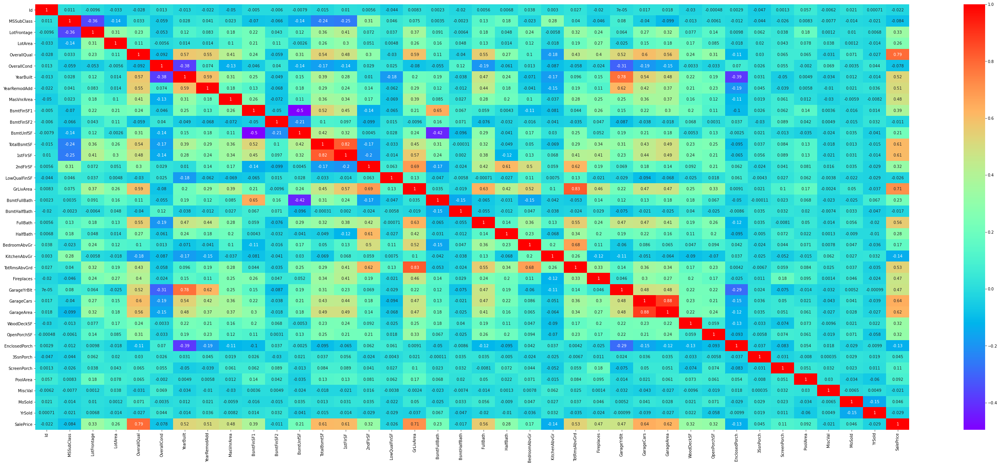
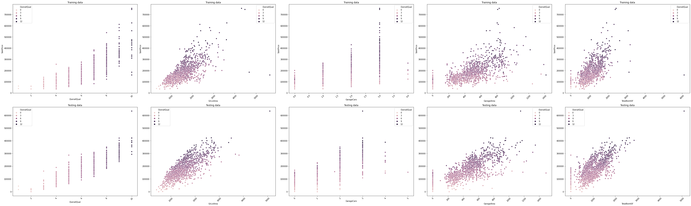

# House Prices
In this project we will predict the house prices using the Regularization Techniques **Lasso**, **Ridge** and **Linear** models.

## 1. Importing and cleaning the data


```python
from scipy import stats
import numpy as np
import pandas as pd 
import matplotlib
import matplotlib.pyplot as plt
import math
import seaborn as sns
import collections
from sklearn.linear_model import Lasso 
from sklearn.linear_model import LinearRegression
from sklearn.linear_model import Ridge
from sklearn.metrics import mean_squared_error
```

Let's read the training and testing data.


```python
train = pd.read_csv("D:/Maestría/AI/Proyecto 1/train.csv")
test = pd.read_csv("D:/Maestría/AI/Proyecto 1/test.csv")
```


```python
display(train.head(),test.head())
```


<div>
<style scoped>
    .dataframe tbody tr th:only-of-type {
        vertical-align: middle;
    }

    .dataframe tbody tr th {
        vertical-align: top;
    }

    .dataframe thead th {
        text-align: right;
    }
</style>
<table border="1" class="dataframe">
  <thead>
    <tr style="text-align: right;">
      <th></th>
      <th>Id</th>
      <th>MSSubClass</th>
      <th>MSZoning</th>
      <th>LotFrontage</th>
      <th>LotArea</th>
      <th>Street</th>
      <th>Alley</th>
      <th>LotShape</th>
      <th>LandContour</th>
      <th>Utilities</th>
      <th>...</th>
      <th>PoolArea</th>
      <th>PoolQC</th>
      <th>Fence</th>
      <th>MiscFeature</th>
      <th>MiscVal</th>
      <th>MoSold</th>
      <th>YrSold</th>
      <th>SaleType</th>
      <th>SaleCondition</th>
      <th>SalePrice</th>
    </tr>
  </thead>
  <tbody>
    <tr>
      <th>0</th>
      <td>1</td>
      <td>60</td>
      <td>RL</td>
      <td>65.0</td>
      <td>8450</td>
      <td>Pave</td>
      <td>NaN</td>
      <td>Reg</td>
      <td>Lvl</td>
      <td>AllPub</td>
      <td>...</td>
      <td>0</td>
      <td>NaN</td>
      <td>NaN</td>
      <td>NaN</td>
      <td>0</td>
      <td>2</td>
      <td>2008</td>
      <td>WD</td>
      <td>Normal</td>
      <td>208500</td>
    </tr>
    <tr>
      <th>1</th>
      <td>2</td>
      <td>20</td>
      <td>RL</td>
      <td>80.0</td>
      <td>9600</td>
      <td>Pave</td>
      <td>NaN</td>
      <td>Reg</td>
      <td>Lvl</td>
      <td>AllPub</td>
      <td>...</td>
      <td>0</td>
      <td>NaN</td>
      <td>NaN</td>
      <td>NaN</td>
      <td>0</td>
      <td>5</td>
      <td>2007</td>
      <td>WD</td>
      <td>Normal</td>
      <td>181500</td>
    </tr>
    <tr>
      <th>2</th>
      <td>3</td>
      <td>60</td>
      <td>RL</td>
      <td>68.0</td>
      <td>11250</td>
      <td>Pave</td>
      <td>NaN</td>
      <td>IR1</td>
      <td>Lvl</td>
      <td>AllPub</td>
      <td>...</td>
      <td>0</td>
      <td>NaN</td>
      <td>NaN</td>
      <td>NaN</td>
      <td>0</td>
      <td>9</td>
      <td>2008</td>
      <td>WD</td>
      <td>Normal</td>
      <td>223500</td>
    </tr>
    <tr>
      <th>3</th>
      <td>4</td>
      <td>70</td>
      <td>RL</td>
      <td>60.0</td>
      <td>9550</td>
      <td>Pave</td>
      <td>NaN</td>
      <td>IR1</td>
      <td>Lvl</td>
      <td>AllPub</td>
      <td>...</td>
      <td>0</td>
      <td>NaN</td>
      <td>NaN</td>
      <td>NaN</td>
      <td>0</td>
      <td>2</td>
      <td>2006</td>
      <td>WD</td>
      <td>Abnorml</td>
      <td>140000</td>
    </tr>
    <tr>
      <th>4</th>
      <td>5</td>
      <td>60</td>
      <td>RL</td>
      <td>84.0</td>
      <td>14260</td>
      <td>Pave</td>
      <td>NaN</td>
      <td>IR1</td>
      <td>Lvl</td>
      <td>AllPub</td>
      <td>...</td>
      <td>0</td>
      <td>NaN</td>
      <td>NaN</td>
      <td>NaN</td>
      <td>0</td>
      <td>12</td>
      <td>2008</td>
      <td>WD</td>
      <td>Normal</td>
      <td>250000</td>
    </tr>
  </tbody>
</table>
<p>5 rows × 81 columns</p>
</div>


<div>
<style scoped>
    .dataframe tbody tr th:only-of-type {
        vertical-align: middle;
    }

    .dataframe tbody tr th {
        vertical-align: top;
    }

    .dataframe thead th {
        text-align: right;
    }
</style>
<table border="1" class="dataframe">
  <thead>
    <tr style="text-align: right;">
      <th></th>
      <th>Id</th>
      <th>MSSubClass</th>
      <th>MSZoning</th>
      <th>LotFrontage</th>
      <th>LotArea</th>
      <th>Street</th>
      <th>Alley</th>
      <th>LotShape</th>
      <th>LandContour</th>
      <th>Utilities</th>
      <th>...</th>
      <th>ScreenPorch</th>
      <th>PoolArea</th>
      <th>PoolQC</th>
      <th>Fence</th>
      <th>MiscFeature</th>
      <th>MiscVal</th>
      <th>MoSold</th>
      <th>YrSold</th>
      <th>SaleType</th>
      <th>SaleCondition</th>
    </tr>
  </thead>
  <tbody>
    <tr>
      <th>0</th>
      <td>1461</td>
      <td>20</td>
      <td>RH</td>
      <td>80.0</td>
      <td>11622</td>
      <td>Pave</td>
      <td>NaN</td>
      <td>Reg</td>
      <td>Lvl</td>
      <td>AllPub</td>
      <td>...</td>
      <td>120</td>
      <td>0</td>
      <td>NaN</td>
      <td>MnPrv</td>
      <td>NaN</td>
      <td>0</td>
      <td>6</td>
      <td>2010</td>
      <td>WD</td>
      <td>Normal</td>
    </tr>
    <tr>
      <th>1</th>
      <td>1462</td>
      <td>20</td>
      <td>RL</td>
      <td>81.0</td>
      <td>14267</td>
      <td>Pave</td>
      <td>NaN</td>
      <td>IR1</td>
      <td>Lvl</td>
      <td>AllPub</td>
      <td>...</td>
      <td>0</td>
      <td>0</td>
      <td>NaN</td>
      <td>NaN</td>
      <td>Gar2</td>
      <td>12500</td>
      <td>6</td>
      <td>2010</td>
      <td>WD</td>
      <td>Normal</td>
    </tr>
    <tr>
      <th>2</th>
      <td>1463</td>
      <td>60</td>
      <td>RL</td>
      <td>74.0</td>
      <td>13830</td>
      <td>Pave</td>
      <td>NaN</td>
      <td>IR1</td>
      <td>Lvl</td>
      <td>AllPub</td>
      <td>...</td>
      <td>0</td>
      <td>0</td>
      <td>NaN</td>
      <td>MnPrv</td>
      <td>NaN</td>
      <td>0</td>
      <td>3</td>
      <td>2010</td>
      <td>WD</td>
      <td>Normal</td>
    </tr>
    <tr>
      <th>3</th>
      <td>1464</td>
      <td>60</td>
      <td>RL</td>
      <td>78.0</td>
      <td>9978</td>
      <td>Pave</td>
      <td>NaN</td>
      <td>IR1</td>
      <td>Lvl</td>
      <td>AllPub</td>
      <td>...</td>
      <td>0</td>
      <td>0</td>
      <td>NaN</td>
      <td>NaN</td>
      <td>NaN</td>
      <td>0</td>
      <td>6</td>
      <td>2010</td>
      <td>WD</td>
      <td>Normal</td>
    </tr>
    <tr>
      <th>4</th>
      <td>1465</td>
      <td>120</td>
      <td>RL</td>
      <td>43.0</td>
      <td>5005</td>
      <td>Pave</td>
      <td>NaN</td>
      <td>IR1</td>
      <td>HLS</td>
      <td>AllPub</td>
      <td>...</td>
      <td>144</td>
      <td>0</td>
      <td>NaN</td>
      <td>NaN</td>
      <td>NaN</td>
      <td>0</td>
      <td>1</td>
      <td>2010</td>
      <td>WD</td>
      <td>Normal</td>
    </tr>
  </tbody>
</table>
<p>5 rows × 80 columns</p>
</div>


Check the information of the data. The target that we want to predict is the Sale Price. Note that some features are of object type.


```python
train.info()
```

    <class 'pandas.core.frame.DataFrame'>
    RangeIndex: 1460 entries, 0 to 1459
    Data columns (total 81 columns):
     #   Column         Non-Null Count  Dtype  
    ---  ------         --------------  -----  
     0   Id             1460 non-null   int64  
     1   MSSubClass     1460 non-null   int64  
     2   MSZoning       1460 non-null   object 
     3   LotFrontage    1201 non-null   float64
     4   LotArea        1460 non-null   int64  
     5   Street         1460 non-null   object 
     6   Alley          91 non-null     object 
     7   LotShape       1460 non-null   object 
     8   LandContour    1460 non-null   object 
     9   Utilities      1460 non-null   object 
     10  LotConfig      1460 non-null   object 
     11  LandSlope      1460 non-null   object 
     12  Neighborhood   1460 non-null   object 
     13  Condition1     1460 non-null   object 
     14  Condition2     1460 non-null   object 
     15  BldgType       1460 non-null   object 
     16  HouseStyle     1460 non-null   object 
     17  OverallQual    1460 non-null   int64  
     18  OverallCond    1460 non-null   int64  
     19  YearBuilt      1460 non-null   int64  
     20  YearRemodAdd   1460 non-null   int64  
     21  RoofStyle      1460 non-null   object 
     22  RoofMatl       1460 non-null   object 
     23  Exterior1st    1460 non-null   object 
     24  Exterior2nd    1460 non-null   object 
     25  MasVnrType     1452 non-null   object 
     26  MasVnrArea     1452 non-null   float64
     27  ExterQual      1460 non-null   object 
     28  ExterCond      1460 non-null   object 
     29  Foundation     1460 non-null   object 
     30  BsmtQual       1423 non-null   object 
     31  BsmtCond       1423 non-null   object 
     32  BsmtExposure   1422 non-null   object 
     33  BsmtFinType1   1423 non-null   object 
     34  BsmtFinSF1     1460 non-null   int64  
     35  BsmtFinType2   1422 non-null   object 
     36  BsmtFinSF2     1460 non-null   int64  
     37  BsmtUnfSF      1460 non-null   int64  
     38  TotalBsmtSF    1460 non-null   int64  
     39  Heating        1460 non-null   object 
     40  HeatingQC      1460 non-null   object 
     41  CentralAir     1460 non-null   object 
     42  Electrical     1459 non-null   object 
     43  1stFlrSF       1460 non-null   int64  
     44  2ndFlrSF       1460 non-null   int64  
     45  LowQualFinSF   1460 non-null   int64  
     46  GrLivArea      1460 non-null   int64  
     47  BsmtFullBath   1460 non-null   int64  
     48  BsmtHalfBath   1460 non-null   int64  
     49  FullBath       1460 non-null   int64  
     50  HalfBath       1460 non-null   int64  
     51  BedroomAbvGr   1460 non-null   int64  
     52  KitchenAbvGr   1460 non-null   int64  
     53  KitchenQual    1460 non-null   object 
     54  TotRmsAbvGrd   1460 non-null   int64  
     55  Functional     1460 non-null   object 
     56  Fireplaces     1460 non-null   int64  
     57  FireplaceQu    770 non-null    object 
     58  GarageType     1379 non-null   object 
     59  GarageYrBlt    1379 non-null   float64
     60  GarageFinish   1379 non-null   object 
     61  GarageCars     1460 non-null   int64  
     62  GarageArea     1460 non-null   int64  
     63  GarageQual     1379 non-null   object 
     64  GarageCond     1379 non-null   object 
     65  PavedDrive     1460 non-null   object 
     66  WoodDeckSF     1460 non-null   int64  
     67  OpenPorchSF    1460 non-null   int64  
     68  EnclosedPorch  1460 non-null   int64  
     69  3SsnPorch      1460 non-null   int64  
     70  ScreenPorch    1460 non-null   int64  
     71  PoolArea       1460 non-null   int64  
     72  PoolQC         7 non-null      object 
     73  Fence          281 non-null    object 
     74  MiscFeature    54 non-null     object 
     75  MiscVal        1460 non-null   int64  
     76  MoSold         1460 non-null   int64  
     77  YrSold         1460 non-null   int64  
     78  SaleType       1460 non-null   object 
     79  SaleCondition  1460 non-null   object 
     80  SalePrice      1460 non-null   int64  
    dtypes: float64(3), int64(35), object(43)
    memory usage: 924.0+ KB
    


```python
test.info()
```

    <class 'pandas.core.frame.DataFrame'>
    RangeIndex: 1459 entries, 0 to 1458
    Data columns (total 80 columns):
     #   Column         Non-Null Count  Dtype  
    ---  ------         --------------  -----  
     0   Id             1459 non-null   int64  
     1   MSSubClass     1459 non-null   int64  
     2   MSZoning       1455 non-null   object 
     3   LotFrontage    1232 non-null   float64
     4   LotArea        1459 non-null   int64  
     5   Street         1459 non-null   object 
     6   Alley          107 non-null    object 
     7   LotShape       1459 non-null   object 
     8   LandContour    1459 non-null   object 
     9   Utilities      1457 non-null   object 
     10  LotConfig      1459 non-null   object 
     11  LandSlope      1459 non-null   object 
     12  Neighborhood   1459 non-null   object 
     13  Condition1     1459 non-null   object 
     14  Condition2     1459 non-null   object 
     15  BldgType       1459 non-null   object 
     16  HouseStyle     1459 non-null   object 
     17  OverallQual    1459 non-null   int64  
     18  OverallCond    1459 non-null   int64  
     19  YearBuilt      1459 non-null   int64  
     20  YearRemodAdd   1459 non-null   int64  
     21  RoofStyle      1459 non-null   object 
     22  RoofMatl       1459 non-null   object 
     23  Exterior1st    1458 non-null   object 
     24  Exterior2nd    1458 non-null   object 
     25  MasVnrType     1443 non-null   object 
     26  MasVnrArea     1444 non-null   float64
     27  ExterQual      1459 non-null   object 
     28  ExterCond      1459 non-null   object 
     29  Foundation     1459 non-null   object 
     30  BsmtQual       1415 non-null   object 
     31  BsmtCond       1414 non-null   object 
     32  BsmtExposure   1415 non-null   object 
     33  BsmtFinType1   1417 non-null   object 
     34  BsmtFinSF1     1458 non-null   float64
     35  BsmtFinType2   1417 non-null   object 
     36  BsmtFinSF2     1458 non-null   float64
     37  BsmtUnfSF      1458 non-null   float64
     38  TotalBsmtSF    1458 non-null   float64
     39  Heating        1459 non-null   object 
     40  HeatingQC      1459 non-null   object 
     41  CentralAir     1459 non-null   object 
     42  Electrical     1459 non-null   object 
     43  1stFlrSF       1459 non-null   int64  
     44  2ndFlrSF       1459 non-null   int64  
     45  LowQualFinSF   1459 non-null   int64  
     46  GrLivArea      1459 non-null   int64  
     47  BsmtFullBath   1457 non-null   float64
     48  BsmtHalfBath   1457 non-null   float64
     49  FullBath       1459 non-null   int64  
     50  HalfBath       1459 non-null   int64  
     51  BedroomAbvGr   1459 non-null   int64  
     52  KitchenAbvGr   1459 non-null   int64  
     53  KitchenQual    1458 non-null   object 
     54  TotRmsAbvGrd   1459 non-null   int64  
     55  Functional     1457 non-null   object 
     56  Fireplaces     1459 non-null   int64  
     57  FireplaceQu    729 non-null    object 
     58  GarageType     1383 non-null   object 
     59  GarageYrBlt    1381 non-null   float64
     60  GarageFinish   1381 non-null   object 
     61  GarageCars     1458 non-null   float64
     62  GarageArea     1458 non-null   float64
     63  GarageQual     1381 non-null   object 
     64  GarageCond     1381 non-null   object 
     65  PavedDrive     1459 non-null   object 
     66  WoodDeckSF     1459 non-null   int64  
     67  OpenPorchSF    1459 non-null   int64  
     68  EnclosedPorch  1459 non-null   int64  
     69  3SsnPorch      1459 non-null   int64  
     70  ScreenPorch    1459 non-null   int64  
     71  PoolArea       1459 non-null   int64  
     72  PoolQC         3 non-null      object 
     73  Fence          290 non-null    object 
     74  MiscFeature    51 non-null     object 
     75  MiscVal        1459 non-null   int64  
     76  MoSold         1459 non-null   int64  
     77  YrSold         1459 non-null   int64  
     78  SaleType       1458 non-null   object 
     79  SaleCondition  1459 non-null   object 
    dtypes: float64(11), int64(26), object(43)
    memory usage: 912.0+ KB
    

The instructions below, exclude those columns of object type and the 'SalePrice' column. In the test data we have not this column.


```python
indexobj_train = train.columns[train.dtypes == "object"]
indexobj_test = test.columns[test.dtypes == "object"]
```


```python
xtrain = train.drop(indexobj_train, axis = 1).drop('SalePrice', axis = 1)
xtest = test.drop(indexobj_test, axis = 1)
```

Before to see the correlation matrix, we will impute the missing values with the mean of the non-missing values of their respective columns. Note that from the training information, there aren't missing values.


```python
xtrain = xtrain.fillna(train.mean())
xtest = xtest.fillna(test.mean())
```

Let's check the new tables.


```python
display(xtrain.head(),xtest.head())
```


<div>
<style scoped>
    .dataframe tbody tr th:only-of-type {
        vertical-align: middle;
    }

    .dataframe tbody tr th {
        vertical-align: top;
    }

    .dataframe thead th {
        text-align: right;
    }
</style>
<table border="1" class="dataframe">
  <thead>
    <tr style="text-align: right;">
      <th></th>
      <th>Id</th>
      <th>MSSubClass</th>
      <th>LotFrontage</th>
      <th>LotArea</th>
      <th>OverallQual</th>
      <th>OverallCond</th>
      <th>YearBuilt</th>
      <th>YearRemodAdd</th>
      <th>MasVnrArea</th>
      <th>BsmtFinSF1</th>
      <th>...</th>
      <th>GarageArea</th>
      <th>WoodDeckSF</th>
      <th>OpenPorchSF</th>
      <th>EnclosedPorch</th>
      <th>3SsnPorch</th>
      <th>ScreenPorch</th>
      <th>PoolArea</th>
      <th>MiscVal</th>
      <th>MoSold</th>
      <th>YrSold</th>
    </tr>
  </thead>
  <tbody>
    <tr>
      <th>0</th>
      <td>1</td>
      <td>60</td>
      <td>65.0</td>
      <td>8450</td>
      <td>7</td>
      <td>5</td>
      <td>2003</td>
      <td>2003</td>
      <td>196.0</td>
      <td>706</td>
      <td>...</td>
      <td>548</td>
      <td>0</td>
      <td>61</td>
      <td>0</td>
      <td>0</td>
      <td>0</td>
      <td>0</td>
      <td>0</td>
      <td>2</td>
      <td>2008</td>
    </tr>
    <tr>
      <th>1</th>
      <td>2</td>
      <td>20</td>
      <td>80.0</td>
      <td>9600</td>
      <td>6</td>
      <td>8</td>
      <td>1976</td>
      <td>1976</td>
      <td>0.0</td>
      <td>978</td>
      <td>...</td>
      <td>460</td>
      <td>298</td>
      <td>0</td>
      <td>0</td>
      <td>0</td>
      <td>0</td>
      <td>0</td>
      <td>0</td>
      <td>5</td>
      <td>2007</td>
    </tr>
    <tr>
      <th>2</th>
      <td>3</td>
      <td>60</td>
      <td>68.0</td>
      <td>11250</td>
      <td>7</td>
      <td>5</td>
      <td>2001</td>
      <td>2002</td>
      <td>162.0</td>
      <td>486</td>
      <td>...</td>
      <td>608</td>
      <td>0</td>
      <td>42</td>
      <td>0</td>
      <td>0</td>
      <td>0</td>
      <td>0</td>
      <td>0</td>
      <td>9</td>
      <td>2008</td>
    </tr>
    <tr>
      <th>3</th>
      <td>4</td>
      <td>70</td>
      <td>60.0</td>
      <td>9550</td>
      <td>7</td>
      <td>5</td>
      <td>1915</td>
      <td>1970</td>
      <td>0.0</td>
      <td>216</td>
      <td>...</td>
      <td>642</td>
      <td>0</td>
      <td>35</td>
      <td>272</td>
      <td>0</td>
      <td>0</td>
      <td>0</td>
      <td>0</td>
      <td>2</td>
      <td>2006</td>
    </tr>
    <tr>
      <th>4</th>
      <td>5</td>
      <td>60</td>
      <td>84.0</td>
      <td>14260</td>
      <td>8</td>
      <td>5</td>
      <td>2000</td>
      <td>2000</td>
      <td>350.0</td>
      <td>655</td>
      <td>...</td>
      <td>836</td>
      <td>192</td>
      <td>84</td>
      <td>0</td>
      <td>0</td>
      <td>0</td>
      <td>0</td>
      <td>0</td>
      <td>12</td>
      <td>2008</td>
    </tr>
  </tbody>
</table>
<p>5 rows × 37 columns</p>
</div>


<div>
<style scoped>
    .dataframe tbody tr th:only-of-type {
        vertical-align: middle;
    }

    .dataframe tbody tr th {
        vertical-align: top;
    }

    .dataframe thead th {
        text-align: right;
    }
</style>
<table border="1" class="dataframe">
  <thead>
    <tr style="text-align: right;">
      <th></th>
      <th>Id</th>
      <th>MSSubClass</th>
      <th>LotFrontage</th>
      <th>LotArea</th>
      <th>OverallQual</th>
      <th>OverallCond</th>
      <th>YearBuilt</th>
      <th>YearRemodAdd</th>
      <th>MasVnrArea</th>
      <th>BsmtFinSF1</th>
      <th>...</th>
      <th>GarageArea</th>
      <th>WoodDeckSF</th>
      <th>OpenPorchSF</th>
      <th>EnclosedPorch</th>
      <th>3SsnPorch</th>
      <th>ScreenPorch</th>
      <th>PoolArea</th>
      <th>MiscVal</th>
      <th>MoSold</th>
      <th>YrSold</th>
    </tr>
  </thead>
  <tbody>
    <tr>
      <th>0</th>
      <td>1461</td>
      <td>20</td>
      <td>80.0</td>
      <td>11622</td>
      <td>5</td>
      <td>6</td>
      <td>1961</td>
      <td>1961</td>
      <td>0.0</td>
      <td>468.0</td>
      <td>...</td>
      <td>730.0</td>
      <td>140</td>
      <td>0</td>
      <td>0</td>
      <td>0</td>
      <td>120</td>
      <td>0</td>
      <td>0</td>
      <td>6</td>
      <td>2010</td>
    </tr>
    <tr>
      <th>1</th>
      <td>1462</td>
      <td>20</td>
      <td>81.0</td>
      <td>14267</td>
      <td>6</td>
      <td>6</td>
      <td>1958</td>
      <td>1958</td>
      <td>108.0</td>
      <td>923.0</td>
      <td>...</td>
      <td>312.0</td>
      <td>393</td>
      <td>36</td>
      <td>0</td>
      <td>0</td>
      <td>0</td>
      <td>0</td>
      <td>12500</td>
      <td>6</td>
      <td>2010</td>
    </tr>
    <tr>
      <th>2</th>
      <td>1463</td>
      <td>60</td>
      <td>74.0</td>
      <td>13830</td>
      <td>5</td>
      <td>5</td>
      <td>1997</td>
      <td>1998</td>
      <td>0.0</td>
      <td>791.0</td>
      <td>...</td>
      <td>482.0</td>
      <td>212</td>
      <td>34</td>
      <td>0</td>
      <td>0</td>
      <td>0</td>
      <td>0</td>
      <td>0</td>
      <td>3</td>
      <td>2010</td>
    </tr>
    <tr>
      <th>3</th>
      <td>1464</td>
      <td>60</td>
      <td>78.0</td>
      <td>9978</td>
      <td>6</td>
      <td>6</td>
      <td>1998</td>
      <td>1998</td>
      <td>20.0</td>
      <td>602.0</td>
      <td>...</td>
      <td>470.0</td>
      <td>360</td>
      <td>36</td>
      <td>0</td>
      <td>0</td>
      <td>0</td>
      <td>0</td>
      <td>0</td>
      <td>6</td>
      <td>2010</td>
    </tr>
    <tr>
      <th>4</th>
      <td>1465</td>
      <td>120</td>
      <td>43.0</td>
      <td>5005</td>
      <td>8</td>
      <td>5</td>
      <td>1992</td>
      <td>1992</td>
      <td>0.0</td>
      <td>263.0</td>
      <td>...</td>
      <td>506.0</td>
      <td>0</td>
      <td>82</td>
      <td>0</td>
      <td>0</td>
      <td>144</td>
      <td>0</td>
      <td>0</td>
      <td>1</td>
      <td>2010</td>
    </tr>
  </tbody>
</table>
<p>5 rows × 37 columns</p>
</div>


# 2. Using Regularization Techniques

See the correlation matrix of the remaining columns.


```python
ytrain = train[['SalePrice']]
corr_mat = pd.concat((xtrain, ytrain),axis=1).corr()

plt.figure(figsize = (50, 20))
sns.heatmap(corr_mat, annot = True, cmap="rainbow")
plt.show()
```





In particular, observe the more correlated features with the Sale Price feature.


```python
corr_mat['SalePrice'].abs().sort_values(ascending=False)[:6]
```


    SalePrice      1.000000
    OverallQual    0.790982
    GrLivArea      0.708624
    GarageCars     0.640409
    GarageArea     0.623431
    TotalBsmtSF    0.613581
    Name: SalePrice, dtype: float64


**********

### 2.1 Lasso Model.
Now we use Lasso Regression to obtain the respective coefficients and then testing the model.


```python
lasso_model = Lasso(alpha=0.5,normalize=False, max_iter=1e6)
lasso_model.fit(xtrain,ytrain)
lasso_model.coef_
```


    array([-1.07763319e+00, -1.81227234e+02, -5.66207156e+01,  4.28348072e-01,
            1.73010187e+04,  4.67987815e+03,  2.71404903e+02,  1.35028844e+02,
            3.12987576e+01,  1.56435834e+01,  4.69415435e+00,  5.74903094e+00,
            3.51745410e+00,  4.37298384e+01,  4.36326521e+01,  1.97030770e+01,
            5.32724217e+00,  9.36476426e+03,  1.99320265e+03,  3.45520020e+03,
           -1.86995656e+03, -1.00779262e+04, -1.23157837e+04,  5.07982534e+03,
            3.94746067e+03,  1.22147656e+02,  1.12578966e+04, -4.18755599e+00,
            2.38743663e+01, -2.90782574e+00,  1.17924969e+01,  1.97540329e+01,
            5.59679182e+01, -2.83387917e+01, -7.36957529e-01, -4.51458795e+01,
           -7.76215975e+02])


See the first ten predictions of the test data.


```python
lasso_model.predict(xtest)[:10]
```


    array([115936.67114683, 151035.00668993, 171990.22766573, 198522.52879085,
           194968.14079063, 181129.92985968, 198664.14098961, 171001.24084641,
           206148.52627933, 112759.63299298])


From the correlation matrix, choose first five more correlated the features with Sale Price in order to compare the results of the predicts and the supervised training data.


```python
fig=plt.figure(figsize=(50,15))

ax=fig.add_subplot(2,5,1)
sns.scatterplot(x='OverallQual',y='SalePrice',data=train.drop(indexobj_train, axis = 1), hue = 'OverallQual')
plt.xticks(rotation = 45)
ax.set_title('Training data')

ax=fig.add_subplot(2,5,6)
sns.scatterplot(xtest.OverallQual,lasso_model.predict(xtest), xtest.OverallQual)
plt.xticks(rotation = 45)
ax.set_title('Testing data')


ax=fig.add_subplot(2,5,2)
sns.scatterplot(x='GrLivArea',y='SalePrice',data=train.drop(indexobj_train, axis = 1), hue = 'OverallQual')
plt.xticks(rotation = 45)
ax.set_title('Training data')

ax=fig.add_subplot(2,5,7)
sns.scatterplot(xtest.GrLivArea,lasso_model.predict(xtest), xtest.OverallQual)
plt.xticks(rotation = 45)
ax.set_title('Testing data')

ax=fig.add_subplot(2,5,3)
sns.scatterplot(x='GarageCars',y='SalePrice',data=train.drop(indexobj_train, axis = 1), hue = 'OverallQual')
plt.xticks(rotation = 45)
ax.set_title('Training data')

ax=fig.add_subplot(2,5,8)
sns.scatterplot(xtest.GarageCars,lasso_model.predict(xtest), xtest.OverallQual)
plt.xticks(rotation = 45)
ax.set_title('Testing data')

ax=fig.add_subplot(2,5,4)
sns.scatterplot(x='GarageArea',y='SalePrice',data=train.drop(indexobj_train, axis = 1), hue = 'OverallQual')
plt.xticks(rotation = 45)
ax.set_title('Training data')

ax=fig.add_subplot(2,5,9)
sns.scatterplot(xtest.GarageArea,lasso_model.predict(xtest), xtest.OverallQual)
plt.xticks(rotation = 45)
ax.set_title('Testing data')

ax=fig.add_subplot(2,5,5)
sns.scatterplot(x='TotalBsmtSF',y='SalePrice',data=train.drop(indexobj_train, axis = 1), hue = 'OverallQual')
plt.xticks(rotation = 45)
ax.set_title('Training data')

ax=fig.add_subplot(2,5,10)
sns.scatterplot(xtest.TotalBsmtSF,lasso_model.predict(xtest), xtest.OverallQual)
plt.xticks(rotation = 45)
ax.set_title('Testing data')
       
fig.tight_layout()  
plt.show()
```





***

### 2.2 Ridge Model.
We can do the same with a Ridge Regression.


```python
ridge_model = Ridge(alpha=0.5)
ridge_model.fit(xtrain, ytrain) 
ridge_model.coef_
```


    array([[-1.07530503e+00, -1.81396503e+02, -5.67604408e+01,
             4.28457247e-01,  1.73008531e+04,  4.67939001e+03,
             2.71772256e+02,  1.35402912e+02,  3.13014352e+01,
             1.00115462e+01, -9.37950517e-01,  9.88467779e-02,
             9.17245023e+00,  1.82750852e+01,  1.82018199e+01,
            -5.69632734e+00,  3.07807947e+01,  9.33819964e+03,
             1.97801214e+03,  3.43805966e+03, -1.87174251e+03,
            -1.00664750e+04, -1.21954541e+04,  5.06851445e+03,
             3.95533248e+03,  1.22064338e+02,  1.12269626e+04,
            -4.09294413e+00,  2.38961207e+01, -2.88800188e+00,
             1.18244202e+01,  1.97840715e+01,  5.59920131e+01,
            -2.83660152e+01, -7.41000172e-01, -4.55495979e+01,
            -7.77150612e+02]])


```python
ridge_model.predict(xtest)[:10].ravel()
```


    array([115992.82460896, 151008.34503057, 172019.86429388, 198536.51451548,
           194959.25644792, 181129.71353576, 198654.11090033, 170992.18983225,
           206152.27330238, 112762.85878034])


***

### 2.3 Linear Model.


```python
linear_model = LinearRegression(normalize=False)
linear_model.fit(xtrain,ytrain)
linear_model.coef_
```


    array([[-1.07785480e+00, -1.81211272e+02, -5.65968157e+01,
             4.28298248e-01,  1.73002589e+04,  4.68037970e+03,
             2.71366790e+02,  1.34951177e+02,  3.12989302e+01,
             9.99872737e+00, -9.50428302e-01,  1.09472391e-01,
             9.15777146e+00,  1.82958074e+01,  1.81991400e+01,
            -5.73655882e+00,  3.07583885e+01,  9.37164719e+03,
             2.00546430e+03,  3.46052913e+03, -1.87254709e+03,
            -1.00809571e+04, -1.23330482e+04,  5.08212413e+03,
             3.94792949e+03,  1.22169048e+02,  1.12620760e+04,
            -4.20075971e+00,  2.38697532e+01, -2.91046901e+00,
             1.17879014e+01,  1.97476930e+01,  5.59647922e+01,
            -2.83357078e+01, -7.36376259e-01, -4.52259456e+01,
            -7.76397909e+02]])


```python
linear_model.predict(xtest)[1:10].ravel()
```


    array([151030.34249911, 171983.97743376, 198518.88320839, 194967.62194488,
           181130.49549801, 198666.26984727, 171002.94888791, 206145.09648223,
           112759.02095325])


**********

## 3. Comparing the results in different models


```python
df=pd.DataFrame()
df['Features'] = xtrain.columns
df['Lasso Coefficients'] = lasso_model.coef_
df['Ridge Coefficients'] = ridge_model.coef_[0]
df['Linear Model Coefficients'] =linear_model.coef_[0]
df.sort_values(by=['Lasso Coefficients'],ascending=False,inplace = True)
df
```


<div>
<style scoped>
    .dataframe tbody tr th:only-of-type {
        vertical-align: middle;
    }

    .dataframe tbody tr th {
        vertical-align: top;
    }

    .dataframe thead th {
        text-align: right;
    }
</style>
<table border="1" class="dataframe">
  <thead>
    <tr style="text-align: right;">
      <th></th>
      <th>Features</th>
      <th>Lasso Coefficients</th>
      <th>Ridge Coefficients</th>
      <th>Linear Model Coefficients</th>
    </tr>
  </thead>
  <tbody>
    <tr>
      <th>4</th>
      <td>OverallQual</td>
      <td>17301.018715</td>
      <td>17300.853147</td>
      <td>17300.258892</td>
    </tr>
    <tr>
      <th>26</th>
      <td>GarageCars</td>
      <td>11257.896641</td>
      <td>11226.962629</td>
      <td>11262.075989</td>
    </tr>
    <tr>
      <th>17</th>
      <td>BsmtFullBath</td>
      <td>9364.764265</td>
      <td>9338.199637</td>
      <td>9371.647190</td>
    </tr>
    <tr>
      <th>23</th>
      <td>TotRmsAbvGrd</td>
      <td>5079.825337</td>
      <td>5068.514446</td>
      <td>5082.124129</td>
    </tr>
    <tr>
      <th>5</th>
      <td>OverallCond</td>
      <td>4679.878150</td>
      <td>4679.390007</td>
      <td>4680.379700</td>
    </tr>
    <tr>
      <th>24</th>
      <td>Fireplaces</td>
      <td>3947.460666</td>
      <td>3955.332483</td>
      <td>3947.929490</td>
    </tr>
    <tr>
      <th>19</th>
      <td>FullBath</td>
      <td>3455.200202</td>
      <td>3438.059662</td>
      <td>3460.529132</td>
    </tr>
    <tr>
      <th>18</th>
      <td>BsmtHalfBath</td>
      <td>1993.202646</td>
      <td>1978.012143</td>
      <td>2005.464300</td>
    </tr>
    <tr>
      <th>6</th>
      <td>YearBuilt</td>
      <td>271.404903</td>
      <td>271.772256</td>
      <td>271.366790</td>
    </tr>
    <tr>
      <th>7</th>
      <td>YearRemodAdd</td>
      <td>135.028844</td>
      <td>135.402912</td>
      <td>134.951177</td>
    </tr>
    <tr>
      <th>25</th>
      <td>GarageYrBlt</td>
      <td>122.147656</td>
      <td>122.064338</td>
      <td>122.169048</td>
    </tr>
    <tr>
      <th>32</th>
      <td>ScreenPorch</td>
      <td>55.967918</td>
      <td>55.992013</td>
      <td>55.964792</td>
    </tr>
    <tr>
      <th>13</th>
      <td>1stFlrSF</td>
      <td>43.729838</td>
      <td>18.275085</td>
      <td>18.295807</td>
    </tr>
    <tr>
      <th>14</th>
      <td>2ndFlrSF</td>
      <td>43.632652</td>
      <td>18.201820</td>
      <td>18.199140</td>
    </tr>
    <tr>
      <th>8</th>
      <td>MasVnrArea</td>
      <td>31.298758</td>
      <td>31.301435</td>
      <td>31.298930</td>
    </tr>
    <tr>
      <th>28</th>
      <td>WoodDeckSF</td>
      <td>23.874366</td>
      <td>23.896121</td>
      <td>23.869753</td>
    </tr>
    <tr>
      <th>31</th>
      <td>3SsnPorch</td>
      <td>19.754033</td>
      <td>19.784072</td>
      <td>19.747693</td>
    </tr>
    <tr>
      <th>15</th>
      <td>LowQualFinSF</td>
      <td>19.703077</td>
      <td>-5.696327</td>
      <td>-5.736559</td>
    </tr>
    <tr>
      <th>9</th>
      <td>BsmtFinSF1</td>
      <td>15.643583</td>
      <td>10.011546</td>
      <td>9.998727</td>
    </tr>
    <tr>
      <th>30</th>
      <td>EnclosedPorch</td>
      <td>11.792497</td>
      <td>11.824420</td>
      <td>11.787901</td>
    </tr>
    <tr>
      <th>11</th>
      <td>BsmtUnfSF</td>
      <td>5.749031</td>
      <td>0.098847</td>
      <td>0.109472</td>
    </tr>
    <tr>
      <th>16</th>
      <td>GrLivArea</td>
      <td>5.327242</td>
      <td>30.780795</td>
      <td>30.758389</td>
    </tr>
    <tr>
      <th>10</th>
      <td>BsmtFinSF2</td>
      <td>4.694154</td>
      <td>-0.937951</td>
      <td>-0.950428</td>
    </tr>
    <tr>
      <th>12</th>
      <td>TotalBsmtSF</td>
      <td>3.517454</td>
      <td>9.172450</td>
      <td>9.157771</td>
    </tr>
    <tr>
      <th>3</th>
      <td>LotArea</td>
      <td>0.428348</td>
      <td>0.428457</td>
      <td>0.428298</td>
    </tr>
    <tr>
      <th>34</th>
      <td>MiscVal</td>
      <td>-0.736958</td>
      <td>-0.741000</td>
      <td>-0.736376</td>
    </tr>
    <tr>
      <th>0</th>
      <td>Id</td>
      <td>-1.077633</td>
      <td>-1.075305</td>
      <td>-1.077855</td>
    </tr>
    <tr>
      <th>29</th>
      <td>OpenPorchSF</td>
      <td>-2.907826</td>
      <td>-2.888002</td>
      <td>-2.910469</td>
    </tr>
    <tr>
      <th>27</th>
      <td>GarageArea</td>
      <td>-4.187556</td>
      <td>-4.092944</td>
      <td>-4.200760</td>
    </tr>
    <tr>
      <th>33</th>
      <td>PoolArea</td>
      <td>-28.338792</td>
      <td>-28.366015</td>
      <td>-28.335708</td>
    </tr>
    <tr>
      <th>35</th>
      <td>MoSold</td>
      <td>-45.145880</td>
      <td>-45.549598</td>
      <td>-45.225946</td>
    </tr>
    <tr>
      <th>2</th>
      <td>LotFrontage</td>
      <td>-56.620716</td>
      <td>-56.760441</td>
      <td>-56.596816</td>
    </tr>
    <tr>
      <th>1</th>
      <td>MSSubClass</td>
      <td>-181.227234</td>
      <td>-181.396503</td>
      <td>-181.211272</td>
    </tr>
    <tr>
      <th>36</th>
      <td>YrSold</td>
      <td>-776.215975</td>
      <td>-777.150612</td>
      <td>-776.397909</td>
    </tr>
    <tr>
      <th>20</th>
      <td>HalfBath</td>
      <td>-1869.956565</td>
      <td>-1871.742510</td>
      <td>-1872.547087</td>
    </tr>
    <tr>
      <th>21</th>
      <td>BedroomAbvGr</td>
      <td>-10077.926247</td>
      <td>-10066.475043</td>
      <td>-10080.957134</td>
    </tr>
    <tr>
      <th>22</th>
      <td>KitchenAbvGr</td>
      <td>-12315.783680</td>
      <td>-12195.454074</td>
      <td>-12333.048186</td>
    </tr>
  </tbody>
</table>
</div>


```python
submission = {
    'Id': test.Id.values,
    'Lasso Model': lasso_model.predict(xtest),
    'Ridge Model': ridge_model.predict(xtest).ravel(),
    'Linear Model': linear_model.predict(xtest).ravel()
}
solution = pd.DataFrame(submission)
solution.style.set_caption("Prediction of test data using different models")
solution.to_csv('solution.csv',index=False)
solution.head()
```


<div>
<style scoped>
    .dataframe tbody tr th:only-of-type {
        vertical-align: middle;
    }

    .dataframe tbody tr th {
        vertical-align: top;
    }

    .dataframe thead th {
        text-align: right;
    }
</style>
<table border="1" class="dataframe">
  <thead>
    <tr style="text-align: right;">
      <th></th>
      <th>Id</th>
      <th>Lasso Model</th>
      <th>Ridge Model</th>
      <th>Linear Model</th>
    </tr>
  </thead>
  <tbody>
    <tr>
      <th>0</th>
      <td>1461</td>
      <td>115936.671147</td>
      <td>115992.824609</td>
      <td>115926.594601</td>
    </tr>
    <tr>
      <th>1</th>
      <td>1462</td>
      <td>151035.006690</td>
      <td>151008.345031</td>
      <td>151030.342499</td>
    </tr>
    <tr>
      <th>2</th>
      <td>1463</td>
      <td>171990.227666</td>
      <td>172019.864294</td>
      <td>171983.977434</td>
    </tr>
    <tr>
      <th>3</th>
      <td>1464</td>
      <td>198522.528791</td>
      <td>198536.514515</td>
      <td>198518.883208</td>
    </tr>
    <tr>
      <th>4</th>
      <td>1465</td>
      <td>194968.140791</td>
      <td>194959.256448</td>
      <td>194967.621945</td>
    </tr>
  </tbody>
</table>
</div>
